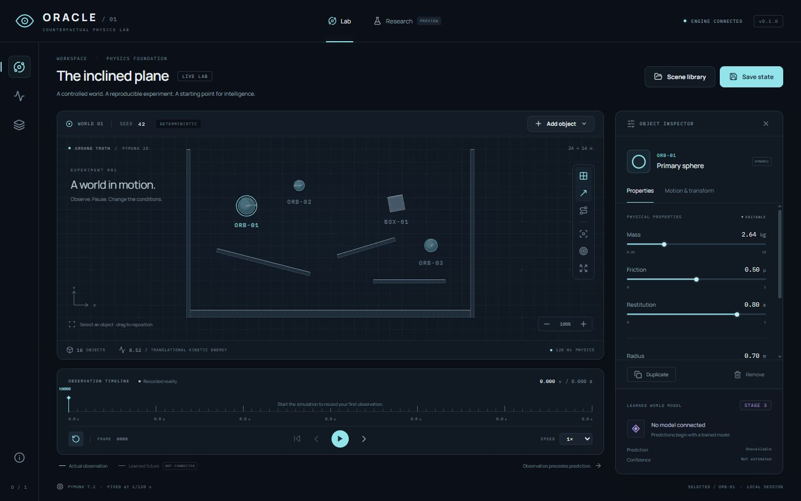
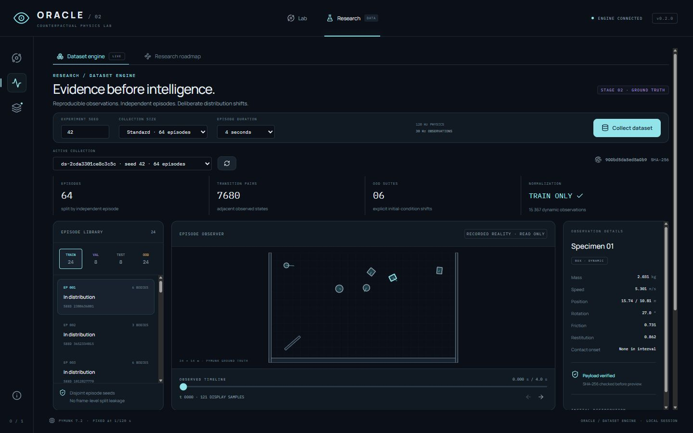
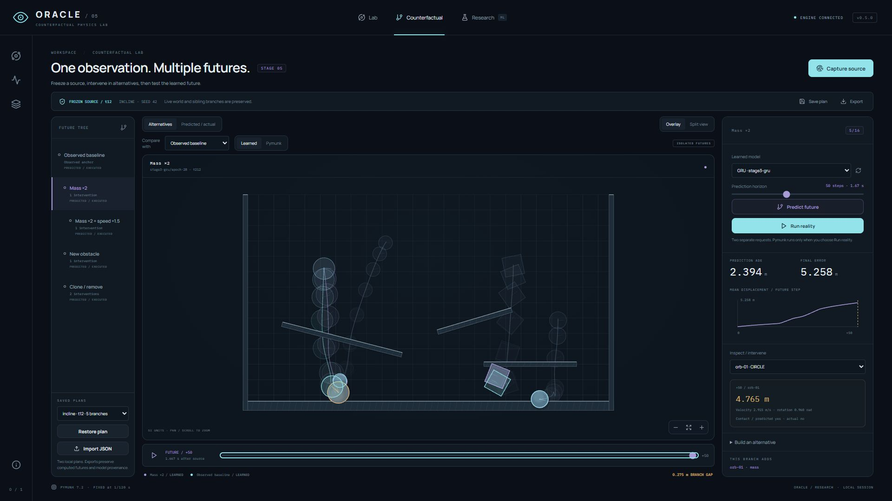
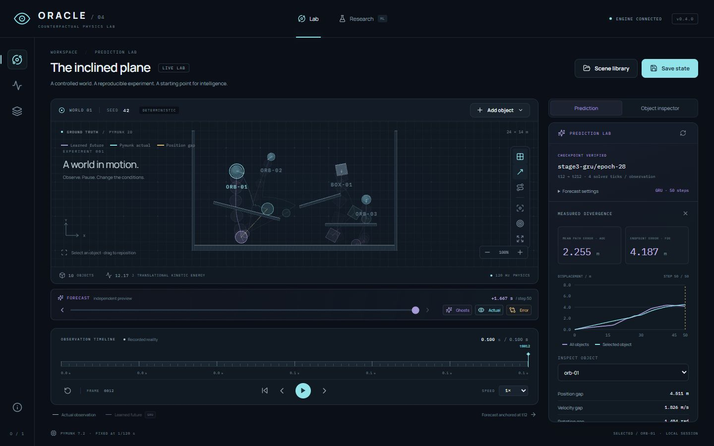
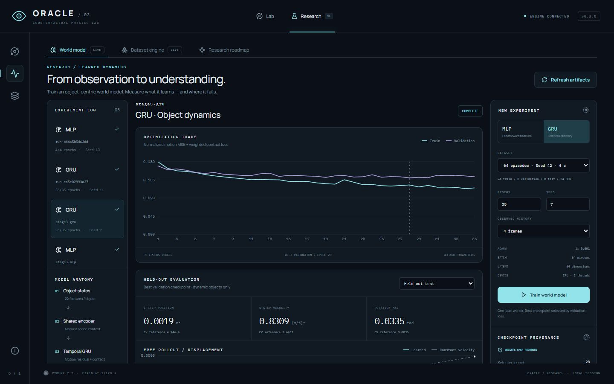

# ORACLE

**Counterfactual Physics Lab** · Interactive laboratory for learned world models and counterfactual reasoning.

## What is ORACLE?

ORACLE studies the gap between what a controlled physical world does and what a learned dynamics model predicts. The intended workflow is observation → intervention → model prediction → ground-truth execution → measured error.

**Stages 1–5 are implemented:** a deterministic 2D laboratory, reproducible datasets, real object-centric PyTorch MLP / GRU training, the Prediction Lab and immutable counterfactual branches. Research shows measured losses and held-out evaluation. Counterfactual Lab freezes an observed source, previews interventions, compares learned alternatives and executes Pymunk reality on a separate explicit request. Both workspaces expose measured errors and provenance-rich JSON exports.

## Core idea

The simulator knows physical dynamics. Future models learn from recorded object observations, without receiving handwritten collision behavior or physics equations as their prediction implementation. Model outputs must remain distinct from simulator outputs.

## Architecture

```text
oracle/
├── backend/
│   ├── oracle/        # physics, sessions, API, model contracts, dataset CLI
│   │   ├── datasets/  # sampling, storage, train normalization, workers
│   │   ├── models/    # shared object encoder, MLP / GRU, checkpoint-backed prediction
│   │   ├── prediction/# real-history capture, isolated inference, replay reference, metrics
│   │   ├── counterfactual/ # immutable plans, interventions, conditioning, isolated execution
│   │   └── training/  # sequences, optimization, checkpointing, metrics, evaluation
│   ├── tests/         # deterministic replay and API tests
│   ├── pyproject.toml
│   ├── requirements.lock.txt
│   └── requirements-ml.lock.txt
├── frontend/
│   ├── src/
│   │   ├── api/       # HTTP and WebSocket transport
│   │   ├── components/# object inspector
│   │   ├── rendering/ # PixiJS scene and camera geometry
│   │   ├── prediction/# model selection, ghost controls, measured forecast errors
│   │   ├── counterfactual/ # branch tree, intervention preview, comparative futures
│   │   ├── research/  # dataset explorer, training dashboard, measured rollout charts
│   │   ├── state/     # typed observation store
│   │   └── timeline/  # recorded state scrubbing and transport
│   └── pnpm-lock.yaml
├── scripts/          # Windows launcher and benchmark
├── docs/             # requirements, architecture, visual verification
├── experiments/      # local exports, ignored by Git
├── datasets/         # generated collections, ignored by Git
├── STAGE_1_REPORT.md
├── STAGE_2_REPORT.md
├── STAGE_3_REPORT.md
├── STAGE_4_REPORT.md
└── STAGE_5_REPORT.md
```

[Architecture](docs/ARCHITECTURE.md) · [Datasets](docs/DATASETS.md) · [Training and evaluation](docs/TRAINING.md) · [Prediction Lab](docs/PREDICTION.md) · [Counterfactual Lab](docs/COUNTERFACTUAL.md) · [Stage 1](STAGE_1_REPORT.md) · [Stage 2](STAGE_2_REPORT.md) · [Stage 3](STAGE_3_REPORT.md) · [Stage 4](STAGE_4_REPORT.md) · [Stage 5 report](STAGE_5_REPORT.md)

Contributor rules: [AGENTS.md](AGENTS.md) · [Git and review workflow](docs/REPOSITORY_WORKFLOW.md). Substantial changes use separate branches and Pull Requests into `main`. GitHub Actions checks the backend on Linux / Windows and the frontend tests, lint, formatting and production build.

## Physics engine

Pymunk 7.2 wraps the established Chipmunk rigid-body engine and integrates directly with Python. A single-threaded Space, fixed `1/120 s` timestep, deterministic object insertion and local seeded RNG provide reproducible tests. Circles and rectangles cover spheres, blocks, ramps, walls and platforms. Ramp angles are rectangle rotations.

Pymunk was chosen over Box2D for its compact Python API and straightforward local installation. Its [Space documentation](https://www.pymunk.org/en/latest/pymunk.html#pymunk.Space) describes the solver and contact cache behavior that motivated replay-based restoration. This is a controlled rigid-body sandbox; extreme velocities may tunnel through thin surfaces, and arbitrary overlapping initial conditions are not physically meaningful experiments.

PixiJS provides GPU rendering, anti-aliased geometry, cached shapes and smooth camera motion. It fits the [scene-graph / Graphics API](https://pixijs.com/8.x/guides/components/scene-objects/graphics) needed for instrumentation and later model trajectories. It never runs a second physics engine.

## World model

Stage 3 implements object encoder → pooled scene context → shared temporal MLP / GRU → learned motion residuals and contact logits. Verified checkpoints implement the `DynamicsModel` protocol and support autoregressive rollouts. Static geometry is context, not a target. Attention and Transformer models follow later; V2 can introduce visual encoders.

## Counterfactual reasoning

Counterfactual Lab captures a paused observation and its source journal. Preview mass, velocity, direction, material or geometry changes; insert, duplicate or remove bodies; save alternatives in an immutable tree. Children inherit interventions at the same observed source tick. Predict each alternative with verified weights, then separately **Run reality** to measure the error. Overlay / split views share a sampled cursor and camera. Neither operation changes the live world. Neutral replay trails are **recorded observations**; violet ghosts are learned outputs; cyan future traces are separately executed Pymunk reality.

Stage 5 uses explicit derived-history conditioning of the existing MLP / GRU: preserve original observations, override the terminal state, project removed identities out, and label repeated anchor placeholders for added bodies as synthetic inputs. These models were not trained on interventions; results are exploratory and uncertainty is unestimated. [Conditioning and branch contract](docs/COUNTERFACTUAL.md).

## Prediction pipeline

In the Lab: paused real observation history → verified trained weights → autoregressive rollout → violet ghosts / separate forecast cursor → measured errors against an independently replayed Pymunk reference. Both futures hold the anchor's conditions and leave live physics untouched. Inference runs in a bounded CPU subprocess; stale live anchors are rejected. Counterfactual Lab retains immutable source anchors even after live edits. Research / CLI retain separate held-out evaluation. Uncertainty remains unestimated. [Prediction measurement contract](docs/PREDICTION.md).

## Screenshots

### Main Lab



[1920×1080 verification](docs/screenshots/main-lab-1920.jpg)

### Research Mode



[1920×1080 dataset explorer](docs/screenshots/dataset-explorer-1920.jpg) · [Stage 1 roadmap archive](docs/screenshots/research-1920.jpg)

### Counterfactual Branches



[Intervention preview at 1440×900](docs/screenshots/stage5-preview-1440.jpg) · [Predicted / actual at 1440×900](docs/screenshots/stage5-predicted-actual-1440.jpg)

### Predicted vs Actual



[1920×1080 verification](docs/screenshots/stage4-prediction-1920.jpg) · [Real-history preparation](docs/screenshots/stage4-preparation-1440.jpg)

### Training Dashboard



[1920×1080 training panel](docs/screenshots/stage3-training-1920.jpg) · [OOD rollout evaluation](docs/screenshots/stage3-evaluation-1440.jpg)

## Demo workflow

1. Open the Lab and start physics with **Play** or **Space**.
2. Pause after an interesting contact. Drag the timeline to any recorded tick.
3. Select a body. Edit its material properties or use **Motion & transform** for position, rotation, velocity and angular velocity.
4. Inspect the scene preview, then **Apply to world**. Editing truncates future observations at the selected tick.
5. Add, duplicate, drag or remove objects while paused. Static ramps / walls can be moved and rotated too.
6. Use focus, follow, pan, scroll zoom and camera reset.
7. **Save state** creates a browser snapshot. Open the library to restore it, export JSON or import an experiment.
8. Choose another scene and seed to start another reproducible experiment.
9. Switch to **Research → Dataset engine**. Choose a collection seed, size and episode duration, then **Collect dataset**. An isolated Python worker collects real observations.
10. Inspect train / validation / test / OOD episodes. Scrub their observed timeline, select a specimen, compare initial mass / speed distributions and inspect normalization provenance.
11. Open **Research → World model**, choose MLP or GRU, a dataset, training seed, epoch count and observed history. **Train world model** launches real optimization in a separate worker.
12. Inspect logged losses and the validation-selected checkpoint. Choose test / OOD groups and rollout horizons, compare with the constant-velocity reference, and export evaluation JSON.
13. Return to **Lab → Prediction**, select a completed model and pause the world. **Record observations** collects the real history needed by its sampling clock.
14. Choose the horizon and **Predict future**. Scrub the separate forecast, compare violet learned ghosts / cyan Pymunk actual, select a body and inspect measured errors. Expand **Forecast settings** to change model / horizon; export the actual report JSON. Edits, seeks and real playback clear stale predictions.
15. Open **Counterfactual**, record any missing real history and **Capture source**. Choose a body, preview an intervention and **Save alternative**. Select a parent before creating a child; all changes use the original observed anchor.
16. **Predict future** uses real model weights. **Run reality** separately executes the branch in Pymunk. Compare alternatives or predicted / actual using overlay / split and the shared cursor. Save plans locally or export the full JSON report. Imported plans are replay-validated and require fresh computed futures.

## Installation

Requirements: Python 3.12+, Node.js 22.12+ (verified with 24.19), pnpm (verified with 11.25). Commands below are PowerShell, from the project root. Python 3.12 was used for verification.

```powershell
py -3.12 -m venv .venv
.\.venv\Scripts\python.exe -m pip install -r backend/requirements.lock.txt
.\.venv\Scripts\python.exe -m pip install --no-deps -e ./backend
.\.venv\Scripts\python.exe -m pip install -r backend/requirements-ml.lock.txt
cd frontend
pnpm install --frozen-lockfile
cd ..
```

For dependency development, use `.\.venv\Scripts\python.exe -m pip install -e './backend[dev]'`. The frontend explicitly allows esbuild's registry package build step in `pnpm-workspace.yaml`.

## Development

Run in two terminals from the root:

```powershell
# Terminal 1
.\.venv\Scripts\python.exe -m uvicorn oracle.api:app --host 127.0.0.1 --port 8011
```

```powershell
# Terminal 2
cd frontend
pnpm run dev
```

Open [ORACLE Lab](http://127.0.0.1:5181). The backend exposes [interactive API docs](http://127.0.0.1:8011/docs). Vite proxies both HTTP and WebSocket connections to port 8011. These ports avoid typical local services on 8000 / 5173. If you change them, update the Vite proxy and backend origin list together.

Optional Windows launcher: `./scripts/dev.ps1` starts hidden processes and saves logs in `.run/`. `./scripts/dev.ps1 -Stop` stops the tracked process trees after checking their IDs and creation timestamps. The launcher checks occupied ports and refuses to replace unrelated services. The two-terminal workflow is also available when you prefer direct control of server lifetimes.

Verification:

```powershell
.\.venv\Scripts\python.exe -m pytest backend/tests
.\.venv\Scripts\python.exe -m ruff check backend scripts/benchmark.py
.\.venv\Scripts\python.exe -m ruff format --check backend scripts/benchmark.py
cd frontend
pnpm test
pnpm run lint
pnpm exec prettier --check src
pnpm run build
pnpm run preview
```

The production preview runs at [127.0.0.1:4181](http://127.0.0.1:4181) and still requires the Python backend. Font files are bundled, so typography does not depend on a third-party font service.

Keyboard shortcuts: **Space** play / pause, **.** one tick, **R** reset camera, **Delete** remove selection. Drag objects while paused; drag empty space or Alt-drag to pan. Scroll zooms around the pointer. Form fields and dialogs retain normal keyboard behavior.

On Windows, start / stop the helper from a normal terminal with permission to manage its own process trees. It now probes loopback ports without WMI, compares numeric process creation timestamps, records ownership before startup validation and reports early failures instead of silently claiming success.

## Dataset generation

Collect the default 64-episode dataset: 24 train, 8 validation, 8 test and 4 episodes for each of six OOD suites. Each episode has 480 solver ticks (4 seconds), sampled every 4 ticks (30 Hz), producing 120 adjacent transition pairs.

```powershell
.\.venv\Scripts\python.exe -m oracle.generate_dataset --seed 42 --output datasets/demo
.\.venv\Scripts\python.exe -m oracle.inspect_dataset datasets/demo
.\.venv\Scripts\python.exe -m oracle.inspect_dataset datasets/demo --pair train --normalized
```

Count and clock flags: `--train`, `--validation`, `--test`, `--ood-per-suite`, `--steps`, `--sample-stride`. `--config config.json` accepts a strict DatasetConfig; `--output path` requires an empty directory. Completed datasets are never overwritten. No browser is required.

The UI exposes the same generator and reuses completed identical configurations. Failed partial collections are preserved in `datasets/.partial/` before a retry. Each collection includes compressed JSON episodes, a versioned manifest, checksums, exact initial conditions and train-only normalization. The catalog inspects immediate subdirectories of `datasets/`.

Splits are assigned before simulation and remain disjoint at episode / seed level. OOD suites cover unseen mass, velocity, orientation, object count, obstacle count and a reserved mass–speed combination. OOD refers to **initial conditions**; later velocities can exceed those ranges under gravity. [Dataset format, boundaries and feature encoding](docs/DATASETS.md).

## Training

```powershell
.\.venv\Scripts\python.exe -m oracle.train --dataset datasets/demo --output checkpoints/mlp --model mlp --epochs 35
.\.venv\Scripts\python.exe -m oracle.train --dataset datasets/demo --output checkpoints/gru --model gru --epochs 35
```

Defaults: CPU, two threads, history four observed frames, 64-dimensional embeddings / hidden state, AdamW lr 0.001, batch 64. `best.pt` is selected by validation alone; `last.pt` contains optimizer / RNG state for exact resume in the verified CPU runtime. Every checkpoint binds dataset hashes, architecture, normalization, gravity and observation clock. [Configuration, resume, artifact layout and bounds](docs/TRAINING.md).

## Evaluation

```powershell
.\.venv\Scripts\python.exe -m oracle.evaluate checkpoints/gru/best.pt --dataset datasets/demo --output experiments/gru-evaluation.json
```

Report one-step position / velocity MSE, periodic rotation MAE, contact classification and autoregressive ADE / FDE at 1 / 5 / 10 / 20 / 50 observed steps. Validation, test and six OOD suites stay separate. The same samples also score a named constant-velocity analytical reference. No confidence estimates are invented. [Measured results and limitations](STAGE_3_REPORT.md).

## Experiments

The shared headless simulation path works without a browser:

```powershell
.\.venv\Scripts\python.exe -m oracle.experiment --seed 42 --scene incline --steps 600 --output experiments/example.json
.\.venv\Scripts\python.exe scripts/benchmark.py
```

An experiment contains schema and engine versions, a null model version, timestamp, seed, complete environment and initial object definitions, ordered edit events, playhead and recorded duration. Import reconstructs the solver history and restores a paused playhead. Equal runs are tested on this platform and pinned Pymunk version; bitwise identity across versions / operating systems is not guaranteed.

## Metrics

The Lab displays observed physical state and **translational kinetic energy**, excluding rotational energy. Prediction reports dynamic-object ADE / FDE, position / velocity MSE, periodic rotation error and contact-onset counts against a separate physical future. Research retains held-out test / OOD evaluation. Undefined classification ratios remain null. See [forecast metrics](docs/PREDICTION.md#metrics) and [research metrics](docs/TRAINING.md#evaluation-definitions). Uncertainty remains unestimated.

## Roadmap

| Stage | Scope | Status |
| --- | --- | --- |
| 1 | Physics foundation and polished visual sandbox | Implemented and verified |
| 2 | Dataset engine, splits, normalization, data explorer | Implemented and verified |
| 3 | Object encoder, MLP / GRU, training, validation and rollout evaluation | Implemented and verified |
| 4 | Learned rollout, ghost futures and prediction error | Implemented and verified |
| 5 | Interventions, branch trees and comparative futures | Implemented and verified |
| 6 | Transformer, object attention and uncertainty | Planned |
| 7 | Model comparison, OOD suites and batch reports | Planned |
| 8 | Planning through learned model rollouts | Planned |

## Limitations

Local prototype: no accounts, remote hosting or persistent session database. Collection, training and inference use separate processes. Browser world snapshots are limited to eight; counterfactual plans to two locally / four per live session, with 16 branches and eight intervention levels. Export important experiments. Recordings stop at 120 simulated seconds, scenes support 64 objects and experiments 512 edits. Seeks replay from the start. Predictions require compatible real history after edits, support up to 120 observed future steps and time out after 45 seconds. Each request starts a fresh CPU worker; startup latency remains. The physical reference ignores edits recorded after its anchor. Use ordinary speeds and avoid heavy initial overlaps. Small learned baselines have substantial OOD / long-horizon drift; Lab scenes are not certified in-distribution. Added-body history in counterfactual model inputs is explicitly synthetic. CUDA training is guarded but unverified. Checkpoints remain local; intervention-specific training, UI training cancellation / resume, advanced batch comparison, uncertainty and 3D are future work. Stage reports record actual verification coverage.

## Research questions

1. How accurately can a learned model predict short-horizon dynamics?
2. How quickly does autoregressive rollout error accumulate?
3. Does it generalize to unseen masses and velocities?
4. Does it generalize to more objects and new obstacle arrangements?
5. Which architecture best captures interacting-object dynamics?
6. Does estimated uncertainty correlate with actual prediction error?
7. Can learned rollouts support planning with real-world verification?
