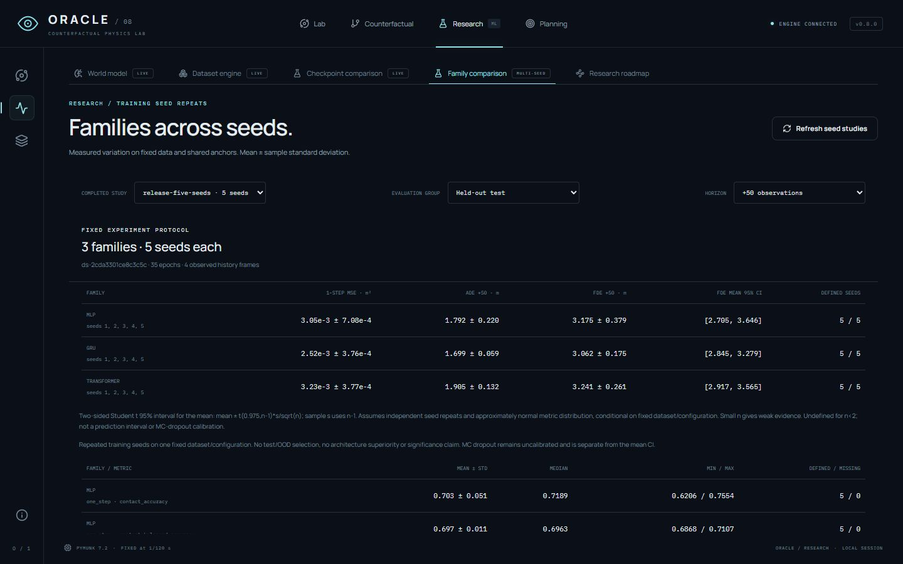

# ORACLE

**Counterfactual Physics Lab** — a local AI research laboratory that keeps learned predictions separate from physical reality.

| Workspace | What it does |
| --- | --- |
| Physics engine | Pymunk computes what actually happens. |
| World model | Trained MLP / GRU / Transformer weights predict what will happen. |
| Counterfactual Lab | The model predicts what would happen after controlled changes; a separate Pymunk execution measures the error. |
| Planning | Nine velocity actions are ranked by predicted distance to a goal; the fixed winner is verified in reality. |

Stages 1–8 are implemented. **FINAL VALIDATION & RELEASE** adds intervention benchmarks,
repeated training seeds, real browser E2E and a protected demo. The release candidate
awaits hosted CI before promotion from 0.8.0 to 1.0.0. Counterfactual conditioning does
not establish causal understanding; planning is bounded search; MC-dropout remains **uncalibrated**.

## Quick Start — Fast Demo

Windows / PowerShell is the primary local environment. Use Python 3.12, Node.js 22.12+
and pnpm 11.25.0 (Node 24 and Python 3.12 are used in CI). From the repository root:

```powershell
py -3.12 -m venv .venv
.\.venv\Scripts\python.exe -m pip install -r backend/requirements.lock.txt
.\.venv\Scripts\python.exe -m pip install --no-deps -e ./backend
.\.venv\Scripts\python.exe -m pip install -r backend/requirements-ml.lock.txt
pnpm --dir frontend install --frozen-lockfile
.\.venv\Scripts\python.exe -m oracle.setup_demo
./scripts/dev.ps1
```

Open [ORACLE](http://127.0.0.1:5181). In **Lab → Prediction**, choose **oracle-demo**,
five future observations, **Record observations**, then **Predict future**. Violet ghosts
are learned output; cyan is independent Pymunk. In **Counterfactual**, capture the source,
preview **Mass ×2**, save an alternative, predict it and separately **Run reality**.
In **Planning**, select the same model, search nine actions and verify the winner.

Setup collects 14 real episodes and trains a three-epoch GRU with deliberately limited
accuracy. Compatible completed output is verified/reused without writing; partial or
incompatible output is preserved and rejected. Datasets and weights stay outside Git.
`./scripts/dev.ps1 -Stop` stops only its tracked processes. For cross-platform or
two-terminal startup, see [Demo and E2E](docs/DEMO_AND_E2E.md). Dependency installation
is the largest first-run cost; the small demo is separate from full research training.

## Measured evidence

The release pass executed **432 source/intervention combinations**, three reference
checkpoints and two horizons: 390 combinations were eligible, 42 explicitly unsupported.
A separate study ran **five training seeds per family**, fifteen runs total.

| Family | Test FDE50 mean ± sample std (m) | 95% interval for the seed mean (m) | OOD macro FDE50 mean ± std (m) |
| --- | ---: | --- | ---: |
| MLP | 3.1755 ± 0.3789 | [2.7051, 3.6459] | 3.5834 ± 0.8091 |
| GRU | 3.0617 ± 0.1747 | [2.8449, 3.2786] | 3.1496 ± 0.1280 |
| Transformer | 3.2409 ± 0.2612 | [2.9166, 3.5652] | 3.2901 ± 0.1671 |

One small procedural dataset and one fixed recipe: the intervals overlap and do not
prove universal architecture superiority. Student t mean intervals describe variation
across training seeds, not trajectory confidence. Existing Transformer MC-dropout h50
coverage is **2.27% x, 11.36% y and 0% joint**: severe undercoverage is retained.

[Release report](RELEASE_1_0_REPORT.md) · [Exact provenance](docs/results/release-provenance.json)
· [Intervention statistics](docs/results/release-counterfactual.csv) · [Seed statistics](docs/results/release-seeds.csv)



[All release browser checks and screenshots](docs/RELEASE_BROWSER_QA.md).

## Full research reproduction

[Full reproduction](docs/REPRODUCTION.md) covers collection, training/evaluation,
matched checkpoint batches, physics experiments and all interactive flows. After
generating `datasets/demo` and compatible checkpoints:

```powershell
.\.venv\Scripts\python.exe -m oracle.counterfactual_benchmark --checkpoint checkpoints/gru/best.pt --scenes 24 --seed 42 --horizons 10 50 --output experiments/counterfactual-24
.\.venv\Scripts\python.exe -m oracle.multiseed --dataset datasets/demo --seeds 1 2 3 4 5 --output experiments/multiseed/five-seeds
```

Output directories must be new. Repeat `--checkpoint` for up to three matched models.
The benchmark supports baseline plus 17 mass, velocity, material, geometry and structural
interventions, with explicit CPU/work/deadline bounds and no heavy launch API.
**Research → Checkpoint comparison** evaluates fixed checkpoints; **Family comparison**
reads completed repeated-seed reports. [Methods and limits](docs/RELEASE_EXPERIMENTS.md).

## Architecture

Python owns physics, observations, training, inference and experiment state. React/Pixi
render returned observations/futures; the browser has no physics engine. Pymunk steps
at 120 Hz; model observations use a separate 30 Hz clock. Normalization is train-only,
selection validation-only, test/OOD use fixed targets and anchors.

`backend/oracle/` separates datasets, models, training, prediction, counterfactual,
research, planning and bounded CLI benchmarking. Frontend live state, recorded playback,
branch state and rendering stay distinct; Research/charts are lazy. Optional `ORACLE_DATA_ROOT`
isolates generated artifacts for E2E without changing source or model contracts.

[Architecture](docs/ARCHITECTURE.md) · [Datasets](docs/DATASETS.md) · [Training](docs/TRAINING.md)
· [Prediction](docs/PREDICTION.md) · [Counterfactual](docs/COUNTERFACTUAL.md)
· [Advanced models](docs/ADVANCED_MODELS.md) · [Research](docs/RESEARCH.md) · [Planning](docs/PLANNING.md)

## Validation and Git workflow

```powershell
.\.venv\Scripts\python.exe -m pytest backend/tests
.\.venv\Scripts\python.exe -m ruff check backend scripts/benchmark.py
.\.venv\Scripts\python.exe -m ruff format --check backend scripts/benchmark.py
.\.venv\Scripts\python.exe -m pip check
pnpm --dir frontend install --frozen-lockfile
pnpm --dir frontend test
pnpm --dir frontend run lint
pnpm --dir frontend exec prettier --check src e2e playwright.config.ts
pnpm --dir frontend exec tsc --project tsconfig.e2e.json
pnpm --dir frontend run build
.\.venv\Scripts\python.exe -m oracle.setup_demo --root .run/e2e --profile smoke
pnpm --dir frontend exec playwright install chromium
pnpm --dir frontend run test:e2e
```

CI: Backend Linux, Backend Windows, Frontend and separate Browser E2E. Five browser
flows use real Pymunk/API/trained weights with an isolated tiny fixture rather than full
research training. [E2E details](docs/DEMO_AND_E2E.md). GitHub is the shared source of truth:
descriptive branches, logical commits, validation and a reviewed PR into `main`.
[AGENTS.md](AGENTS.md) · [Repository workflow](docs/REPOSITORY_WORKFLOW.md).

## Limits

A local portfolio/research project with bounded recordings, libraries and workers:
export important experiments. Models drift over long horizons and can fail under
structural changes; added-body history is explicitly synthetic. Dropout is uncalibrated.
Planning changes velocity once and searches nine actions, with no global optimality.
CUDA, mobile, hosted multi-user operation and cross-platform bitwise determinism are
unverified. The release report retains measured failures and remaining limitations.

Historical evidence: [Stage 1](STAGE_1_REPORT.md) · [Stage 2](STAGE_2_REPORT.md)
· [Stage 3](STAGE_3_REPORT.md) · [Stage 4](STAGE_4_REPORT.md) · [Stage 5](STAGE_5_REPORT.md)
· [Stage 6](STAGE_6_REPORT.md) · [Stage 7](STAGE_7_REPORT.md) · [Stage 8](STAGE_8_REPORT.md).
