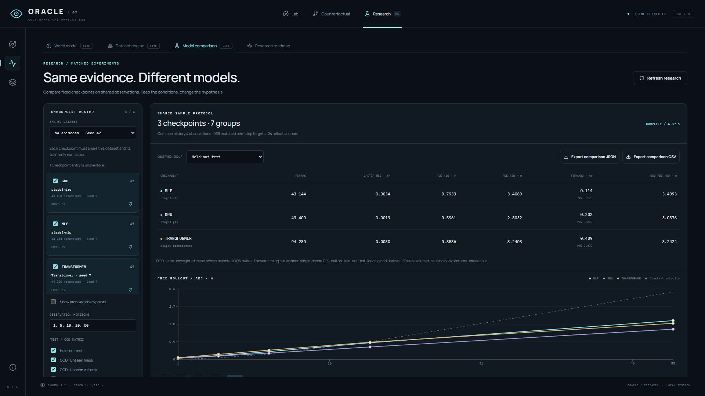
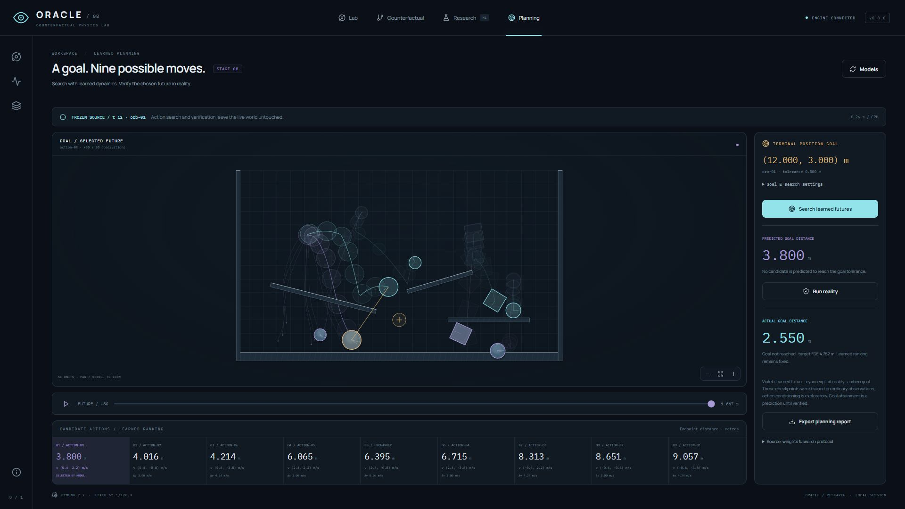

# ORACLE — Stages 1–8 report

This document consolidates the eight original implementation reports in stage order.
Measured results, provenance, test counts, screenshots and limitations are preserved.
Versions, completed checks and next-stage plans describe the project at the time of
each report; they are historical evidence rather than the current release status.
See [ORACLE 1.0 release validation](RELEASE_1_0_REPORT.md) for the final evaluation.

## Contents

- [Stage 1](#oracle--stage-1-report)
- [Stage 2](#oracle--stage-2-report)
- [Stage 3](#stage-3--learned-world-model)
- [Stage 4](#stage-4--prediction-lab)
- [Stage 5](#stage-5--counterfactual-lab)
- [Stage 6](#stage-6-report--advanced-world-models)
- [Stage 7](#stage-7-report--research-platform)
- [Stage 8](#stage-8-report--learned-rollout-planning)

## ORACLE — Stage 1 report

Verified **4 October 2026**, Europe/Warsaw. Stage 1 implements the ground-truth physics foundation and visual laboratory. This report makes no learned-model performance claims.

### Implemented

- Python / FastAPI backend with per-session worlds and WebSocket observation streaming.
- React / strict TypeScript / PixiJS / Zustand frontend with a complete instrumented visual identity.
- Seeded scene library: inclined plane, collision chamber and blank canvas.
- Circles, dynamic boxes, static ramps, walls and platforms; creation, selection, paused dragging, editing, duplication and removal.
- Play, pause, single solver tick, speed selection and timeline scrubbing to any recorded tick.
- Smooth pan / zoom / reset / focus / follow camera, observed velocity vectors, recorded trails and contact pulses.
- Browser snapshots, JSON export / import, validated portable experiments and replay-based restoration.
- Shared headless experiment runner, benchmark, Windows start / stop helper, pinned dependencies and Git ignore rules.
- Model / intervention / prediction interfaces and an explicit Stage 2–8 roadmap. No full ML implementation or fabricated prediction UI.

### Architecture

`world.py` provides SI-unit schemas; `scenes.py` owns seeded initial conditions; `physics.py` is the Pymunk adapter; `session.py` owns recording, replay and edits; `api.py` owns transport. Frontend rendering, coordinate geometry, observation state, inspector, timeline and research screen have separate modules.

The browser receives observations and interpolates transforms. It does not compute collisions or integrate a second physical world. Predictions have a separate future contract and must identify their learned model and uncertainty method.

Experiments save original object definitions, environment parameters, seed, engine / schema versions, null model version, timestamp, ordered edits and timeline position. Solver state is reconstructed by replay, including contact history. Editing the past truncates the later recording.

### Physics

Pymunk 7.2 / Chipmunk, one solver thread, 20 iterations, fixed `1/120 s` integration step. Playback speed changes how many fixed ticks run per wall-clock interval. Coordinates use metres, velocities metres/second, mass kilograms and backend angles radians. UI angular position is displayed in degrees.

Determinism is verified for identical scene definitions, engine version and platform, including collisions and edits. Replay of a snapshot after contact produces the same states and continuing rollout. No bitwise portability claim is made across engine versions or platforms.

### Frontend

The world dominates the desktop workspace width. Its toolbar and telemetry frame the simulation; a fixed inspector and discrete timeline keep editing and playback readable. Shape rendering, camera motion, selection outlines, intervention previews and collision pulses communicate state. Curves are tessellated at pixel-sized geometry scale and transformed back to metres to avoid visibly polygonal circles when zoomed.

Static shape geometry is cached. Dynamic transforms are interpolated between observations. Grid, vectors and recorded trails can be switched independently. Resetting the camera exits follow mode so it can return to the full scene.

Snapshots are stored in the browser with an eight-item cap. Bad imports produce readable errors; a failed backend import leaves the world unchanged. Selection, no-model and no-snapshot empty states are deliberate parts of the layout. Restore / scene preparation / save show operation status.

### Visual design

Central palette, spacing, radii, shadows, fonts and motion durations are defined in `styles.css`. Graphite / navy surfaces, cold cyan controls and muted violet model status form the visual language. Manrope and IBM Plex Mono are served as local font assets.

Visual checks:

| Viewport | Horizontal document overflow | World / inspector overlap | Result |
| --- | --- | --- | --- |
| 1440×900 | None: scroll width 1440 | None | Passed |
| 1920×1080 | None: scroll width 1920 | None | Passed |

At 1440×900, the world panel is 984 px wide and the inspector 302 px wide. The inspector scrolls internally instead of covering the world. The same hierarchy expands at 1920×1080. A stacked layout is provided for smaller screens; mobile interaction coverage is limited to the responsive implementation and was not exhaustively tested.

Evidence: [1440 Main Lab](docs/screenshots/main-lab-1440.jpg), [1920 Main Lab](docs/screenshots/main-lab-1920.jpg), [Research roadmap](docs/screenshots/research-1920.jpg).

### Testing

#### Tests

| Check | Result |
| --- | --- |
| Backend pytest | **36 passed** |
| Frontend Vitest | **13 passed** |
| Ruff lint | Passed |
| Ruff formatting check | Passed |
| ESLint | Passed |
| Strict TypeScript compilation | Passed |
| Vite production build | Passed, no oversized-chunk warning after React split |
| Headless experiment command | Passed; 240 ticks exported |
| Backend health / frontend HTTP | Passed on ports 8011 / 5181 |
| Production preview | Loaded, connected via WebSocket, advanced and reset physics |
| Windows launcher | Start, stop, port release and restart verified |

Backend coverage includes seeded scenes, collision determinism, actual gravity / ground contact, serialization, seek / resume, same-tick edits, truncating future edits, isolated clones, adding / removing bodies, invalid edits, unsupported schemas / engine versions, failed imports, object limits, recording limits, large evolving coordinates / rotation and transform payloads.

Frontend coverage includes coordinate round trips at both required resolutions, y-axis conversion, rotated picking geometry, timeline bounds, transform merging, selection removal, trail invalidation, preview clearing, camera reset exiting follow and the distinction between the research page and observed world state.

One dependency deprecation warning remains: the installed Starlette TestClient warns about httpx. It does not fail the tests. Dataset, model tensor, training, metrics and checkpoint tests are future-stage work because their implementations are intentionally absent.

Git is initialized on `main` with ignore rules for environments, datasets, checkpoints and build outputs. Commits were not created because this machine has no configured `user.name` / `user.email`; the source remains ready for review and commit after author configuration.

#### Manual verification

Using the actual in-app browser, not a static mockup:

- Started physics, observed changing positions / velocity / energy, paused and stepped one tick.
- Set playback speed to 2× and loaded collision scene seed 77.
- Rewound an observed recording to tick 240; edited position to `(7.5, 8)` with a scene preview and applied it.
- Saved the edited state; reset the world; restored tick 240 through the snapshot library.
- Added and inspected a static ramp; duplicated a sphere and removed its copy.
- Dragged a sphere in the production build; observed its position change to approximately `(7.91, 10.41)`.
- Checked focus / follow, reset exiting follow, button zoom (100% → 115%), wheel zoom (115% → 151%) and empty-space pan.
- Verified refined Main Lab and Research layouts at both target sizes, internal inspector scrolling and no panel overlap.
- Checked production browser logs: no error / warning entries during the production smoke run.
- Verified the disconnected-engine UI during backend restarts and healthy reconnection on reload.

**Automation boundary:** the export button was invoked, but the in-app browser's download-event wait timed out. A native browser download was not confirmed by that automation. JSON content and import / replay are validated through the API and headless runner; browser snapshot save / restore was confirmed visually. File chooser upload was not exercised end to end by browser automation.

### Performance

Measured on this Windows 11 / Python 3.12.14 environment, seed 42, 10 objects, 2400 recorded ticks:

| Measurement | Observed value |
| --- | --- |
| Simulation including history | 0.2654 s |
| Mean solver tick including history | 0.1106 ms |
| Replay seek to tick 2000 | 154.82 ms |
| Full JSON payload at sampled state | 3452 bytes |
| Dynamic transform JSON payload | 950 bytes |
| Physics / observation stream | 120 Hz / 20 Hz |

These are a single local benchmark, not latency or scaling guarantees. Run `scripts/benchmark.py` to remeasure. Renderer FPS is independent of the solver. Browser history samples are bounded; full server recordings have finite duration. Import replay runs outside the API event loop; long seeks still replay synchronously and may briefly delay other local sessions.

The final main JS chunk is approximately 340 kB before gzip (107 kB gzip); the React chunk is about 222 kB (69 kB gzip). Optional rendering backends remain split. No external font request is required.

### Known limitations

- Local, single-process deployment; no persistent server database, accounts or remote collaboration.
- Up to 64 objects, 512 edits, 14,400 ticks and 16 retained sessions; idle disconnected sessions expire after 30 minutes. Recordings retain full per-tick object state, so memory grows with object count and duration.
- Snapshot portability depends on supported schema / Pymunk versions. Cross-platform bitwise equality is not certified.
- Thin surfaces and extreme velocities can tunnel; overlapping initial scenes can create strong impulses. This is not a continuous-collision or high-speed numerical benchmark suite.
- Browser snapshots can be removed by storage reset. Export important experiments; native browser download / file chooser QA remains a follow-up noted above.
- No learned predictions, probabilistic futures, model confidence, branch trees, split / difference views, training dashboard or latent-space analysis in Stage 1.
- Generalization, collision prediction accuracy, ADE / FDE and planning require real training and evaluation in later stages.

### Roadmap

2. Dataset engine: randomized scenes, reproducible episodes, episode-level splits, train-only normalization, explicit OOD suites and a data explorer.
3. Object-centric world model: PyTorch object encoder, MLP / GRU baselines, training and validation, checkpoint metadata and autoregressive rollout.
4. Prediction lab: learned future trajectories, error versus horizon and predicted / actual comparisons.
5. Counterfactual lab: immutable source snapshots, interventions, branches, multiple futures and reality execution.
6. Advanced models: temporal Transformer, relational attention and calibrated uncertainty estimates.
7. Research platform: fair model comparison, OOD experiments, batch runs and reports.
8. Planning: candidate interventions evaluated through learned rollouts and checked in ground truth.

### Next Stage

Implement Stage 2 on the shared headless physics path. Start with dataset schemas and reproducibility / split-isolation tests, then scene sampling and episode generation. Keep train, validation, test and OOD episode seeds disjoint, fit normalization on train only, record the exact engine / environment configuration and inspect generated scenes before training any model.

---

## ORACLE — Stage 2 report

Verified **4 October 2026**, Europe/Warsaw. Stage 2 implements the dataset foundation and observation explorer. It does not train a world model or claim generalization performance.

### Implemented

- Procedural circles / boxes and randomized ramp obstacles, with non-overlapping dynamic spawn, variable counts, mass, dimensions, material properties, orientations and linear / angular velocities.
- Deterministic episode seeds derived from master seed, split, suite and index; train / validation / test / OOD remain disjoint at episode level.
- Six explicit OOD suites: mass, velocity, angle, object count, obstacle count and a reserved mass–speed combination.
- Versioned, compressed JSON episodes, manifest, canonical SHA-256 content fingerprints, exact origins, configuration, runtime and UTC timestamp.
- Train-only streaming population normalization, constant-feature handling, reversible per-object transforms and checksum-bound provenance.
- Object-centric adjacent-frame iterator with static context, categorical shape, stable IDs, 13 continuous features, sample interval and contact-onset labels.
- Real headless commands: `oracle.generate_dataset` and `oracle.inspect_dataset`.
- Research UI: background collection controls / progress, dataset catalog, split / suite filters, observed scene and timeline, specimen inspection, distribution histograms and normalization statistics.
- Readable failure states, validated bounds, completed-dataset reuse and preservation of failed partial work.

### Architecture

The existing `PhysicsEngine` remains the only dynamics authority. Collection runs in a separate hidden Python process. A scene is generated from a split-owned seed, simulated at 120 Hz and sampled at an independent observation stride. Files are written one episode at a time; training statistics are fitted only after collection; the manifest is published last.

The UI receives verified recorded frames, never future predictions. Research SVG rendering reads transforms; Lab continues to use PixiJS. No physics is duplicated in TypeScript. No new runtime dependency was needed for Stage 2.

[Dataset specification](docs/DATASETS.md) · [Architecture](docs/ARCHITECTURE.md).

### Physics

Same pinned Pymunk 7.2, single-threaded 120 Hz / 20-iteration solver as Stage 1. Procedural sampling changes initial conditions, not integration rules. Body identities and ordering remain stable. Short contact onsets are accumulated over each observation interval so stride sampling does not silently omit them.

OOD labels apply to initial conditions. Later speeds / rotations can leave those ranges under real dynamics. The joint upper mass–speed region is excluded from all in-distribution splits and reserved for the combination suite. Thin-surface / fast-motion solver limitations remain; there is no claim of universal physical fidelity.

### Frontend and visual design

Research extends ORACLE's shared colours, fonts, spacing and motion tokens. Independent split colours, read-only scene status, payload-verification feedback and normalization provenance communicate research ownership. All histogram values are computed from collected initial states. There are no invented losses or model scores.

Episode list, timeline and inspector were checked for resizing and internal scrolling. The scene / library / inspector have bounded heights to avoid a long episode list stretching the observer. Initial-condition details can be expanded within the inspector. SVG specimens support keyboard selection.

| Viewport | Horizontal document overflow | Library / scene / inspector overlap | Result |
| --- | --- | --- | --- |
| 1440×900 | None, document width 1440 | None | Passed |
| 1920×1080 | None, document width 1920 | None | Passed |

Evidence: [1440 explorer](docs/screenshots/dataset-explorer-1440.jpg), [1920 explorer](docs/screenshots/dataset-explorer-1920.jpg), [normalization inspector](docs/screenshots/dataset-normalization-1440.jpg). Analysis panels are reached by normal vertical workspace scrolling. Mobile has a stacked layout; exhaustive touch QA was not performed.

### Testing

#### Automated verification

| Check | Result |
| --- | --- |
| Backend pytest, including Stage 1 regression suite | **69 passed** |
| Frontend Vitest, including existing geometry / store tests | **21 passed** |
| Ruff lint / formatting | Passed |
| ESLint / Prettier | Passed |
| Strict TypeScript / Vite production build | Passed |
| Production preview | Connected, opened the collection and advanced an observation; no browser error / warning logs |
| Full dataset inspection / independent reproduction | Passed, same content fingerprint |
| Desktop visual checks | Passed at 1440×900 and 1920×1080 |

The dataset tests cover repeated payloads, seed isolation, procedural bounds / placement, exact observed solver states, interval contact accumulation, independent normalization refitting, changes to OOD without changes to train statistics, static exclusion, constant features, transition identity, serialization / checksum failures, existing-data protection, real CLI collection / inspection, subprocess status polling across three seeds and preservation of partial output. The full inspector also regenerates initial scenes from their seeds and checks summary statistics against payloads.

The frontend tests cover dataset split / suite filtering, histogram boundaries, collection configuration and invalid seeds, alongside the existing geometry, timeline and observation-store suite.

One existing dependency warning remains: Starlette TestClient deprecates its httpx adapter. It does not fail tests.

#### Actual browser verification

- Collected the standard dataset through the running UI: **64 episodes**, **7,680 transition pairs**, 121 observed frames per episode.
- Verified collection progress / disabled controls and successful dataset publication. Identical configuration reuses the existing completed dataset.
- Opened train, validation, test and OOD episodes. Filtered unseen-mass OOD to four episodes.
- Scrubbed to the last observation at tick 480 / 4.000 s; selected a different circle and observed its real mass / velocity / position.
- Stepped validation from tick 0 to tick 4, corresponding to one 30 Hz observation interval.
- Inspected actual mean / scale statistics from 24 train episodes and **15,367 dynamic observations**.
- Entered seed −1; a readable validation error appeared, preserving the collected dataset.
- Checked layout at both required desktop sizes and saved screenshots.

Two Windows issues were found through actual use and fixed. Atomic status-file replacement can briefly conflict with a reader, so both publication and concurrent opening now retry transient sharing violations; concurrent polling is covered by worker tests across three seeds. The launcher formerly hid denied WMI access and compared a string timestamp with an automatically parsed date; it now probes loopback ports without WMI, compares numeric creation ticks, records ownership before startup checks and reports early exits. Start / stop / restart were rechecked on the actual application.

### Reproduction evidence and performance

The browser collection and a separate headless collection produced the same dataset ID and full content fingerprint:

```text
ds-2cda3301ce8c3c5c
900bd5da5ed8a0b97b541f1a42669ffe3f4edbac86ee2f3bfe80e9d77cd5132e
```

Both passed the full inspector, including independent train-only normalization refitting. The manifest timestamp differs between runs; it is excluded from content identity.

One local headless measurement: **3.700 s** including process startup, 64 × 480 ticks, compression and normalization. The collection uses **2,356,693 bytes** in 66 files (64 compressed episodes, normalization and manifest). This is a small demonstration / QA dataset, not a recommendation for sufficient training volume or a scaling guarantee. Runtime: Windows, Python 3.12.14, pinned Pymunk 7.2.

### Known limitations

- Dataset schema is object-state based; no image dataset, camera observations, intervention episodes or learned labels.
- Split isolation is episode / seed based. No empirical ML generalization scores are available before Stage 3 training.
- The world has no roof; fast objects may leave the visible region / escape over a wall. Stored observations are preserved, not clipped. Filtering for future experiments must be explicit.
- The procedural family is limited to circles, boxes and ramps within one environment. Its OOD suites test specified shifts, not every unseen physical situation.
- Each episode is held in memory while collecting; datasets are streamed episode by episode. API and CLI have explicit bounded sizes.
- One local collection worker; no distributed scheduler, persistent supervisor, cancellation UI, partial resume or migration tooling. Backend restart loses in-memory worker supervision; artifacts remain on disk.
- Dataset files and logs remain local under ignored `datasets/`. Browser snapshots remain separate Stage 1 experiments.
- PyTorch models, training, checkpoints, learned predictions, uncertainty and branch comparisons are intentionally absent.
- Git author identity is still unconfigured; source and documentation are reviewable, with no invented-author commits. Ignore rules now scope generated datasets to the root data directory while retaining the backend dataset source package.

### Roadmap

Stages 1–2 are complete. Stage 3 should introduce object encoders and replaceable MLP / GRU dynamics, masks for variable object counts, reproducible training / validation, one-step and autoregressive evaluation and configuration-rich checkpoints. Stages 4–8 retain their prediction, counterfactual, advanced-model, research-comparison and planning boundaries.

### Next Stage

Use the verified pair iterator as the training boundary. Freeze dataset identity, feature schema and train normalizer into checkpoint metadata; keep validation and OOD out of fitting. Start with an object-centric baseline, measure against a clearly named naive baseline, report dynamic-object errors by horizon and split, and expose only actual logged metrics in Research. Model prediction endpoints must be backed by trained weights and remain separate from ground truth.

---

## Stage 3 — Learned World Model

Verified locally on 2026-10-05. Branch: `feature/learned-world-model`.

### Delivered

- Real PyTorch object-centric MLP and GRU baselines with a shared object encoder, masked scene context, learned motion residuals and contact-onset logits.
- Checksum-verified temporal windows, variable object counts, static context masks and strictly separated train / validation / test / OOD ownership.
- Seeded AdamW training, validation-selected best weights, measured epoch logs, checkpoint integrity checks and exact CPU resume in the verified runtime.
- One-step and free autoregressive evaluation at 1 / 5 / 10 / 20 / 50 observed steps, physical-unit metrics and an explicitly analytical constant-velocity reference.
- A checkpoint-backed `DynamicsModel` adapter that returns learned frames and never invokes physics.
- Research training controls, actual progress, loss curves, held-out groups, numeric horizon charts, checkpoint provenance and JSON evaluation export. One isolated interactive worker with a shared lock; no PyTorch import in the API process.

Important modules: `backend/oracle/models/`, `training/`, `train.py`, `evaluate.py`, `backend/tests/test_training.py`, `frontend/src/research/TrainingDashboard.tsx`, `training.ts` and `training.css`. [Training specification](docs/TRAINING.md) and [requirements](docs/STAGE_3_REQUIREMENTS.md) describe the contracts.

### Actual training evidence

Both formal baseline runs use the existing Stage 2 dataset `ds-2cda3301ce8c3c5c`: 64 episodes, 24 train / 8 validation / 8 test / 24 OOD, 480 solver ticks per episode, stride four (30 Hz observed frames). Dataset SHA-256 is `900bd5da5ed8a0b97b541f1a42669ffe3f4edbac86ee2f3bfe80e9d77cd5132e`; normalizer SHA-256 is `05dd444ab5b6f63715253de5e40c6e714bc08cd111f9891d6544dd2e1ec693fb`.

Recipe: seed 7, 35 epochs, four observed history frames, encoder / hidden size 64, batch 64, AdamW lr 0.001, contact weight 0.1, CPU / two threads. There are 2,808 train and 936 validation windows. Test / OOD results were computed after validation-only selection; these results did not tune or select the model.

Runtime: Python 3.12.14, PyTorch 2.14.1+cpu, NumPy 2.5.2, Windows / AMD64. CUDA was unavailable. Elapsed training-engine times include verification, training and held-out evaluation, and exclude importing PyTorch / worker startup.

| Run | Parameters | Best validation epoch | Best validation objective | Train objective, epoch 1 → 35 | Engine elapsed |
| --- | ---: | ---: | ---: | ---: | ---: |
| MLP | 43,144 | 22 | 0.143539 | 0.180126 → 0.113440 | 9.773 s |
| GRU | 43,400 | 28 | 0.140023 | 0.179304 → 0.114983 | 15.137 s |

Local best-weight hashes:

- MLP: `f0a01d528ba51455896ee221595c39087d3b7b2e411deed73a61ee815ef123d4`
- GRU: `af4edee75ab667fc7b920347bfc7f09ca0c3044d95a5cebea792e66870d67d2a`

These artifacts remain in ignored `checkpoints/stage3-mlp/` and `checkpoints/stage3-gru/`; generated weights and data are not committed. A fresh checkout reproduces the dataset and training using documented commands. Hashes identify this run, not a promise of identical serialized file bytes on another machine.

### Held-out test results

One-step metrics score all test windows; rollouts use 24 deterministic anchors across eight test episodes. Fifty observed steps equal 1.667 seconds. Position / velocity MSE average the two components; ADE / FDE measure Euclidean displacement in metres.

| Model | Position MSE, m² | Velocity MSE, (m/s)² | Rotation MAE, rad | One-step contact balanced accuracy | FDE 10, m | ADE 50, m | FDE 50, m |
| --- | ---: | ---: | ---: | ---: | ---: | ---: | ---: |
| Constant velocity | 0.000474 | 1.643288 | 0.003601 | 50.0% | 0.702041 | 3.441830 | 7.803390 |
| MLP | 0.003394 | 0.848850 | 0.040865 | 70.2% | 0.793328 | 1.978849 | 3.406891 |
| GRU | 0.001882 | 0.830860 | 0.033474 | 71.4% | 0.596145 | 1.544273 | 2.803174 |

The learned models improve test velocity error and 50-step displacement compared with this limited reference. GRU also improves 10-step FDE. Both have worse one-step position and rotation error than constant velocity; MLP also has worse 10-step FDE. Lower validation objective is not evidence that every physical metric improves. Long-horizon errors of several metres remain material in a 24 × 14 m world.

### OOD results

Each suite uses four independently seeded episodes and 12 matched rollout anchors. These are single-seed baseline measurements, not confidence intervals or an exhaustive model comparison.

| Initial-condition shift | MLP velocity MSE | GRU velocity MSE | CV velocity MSE | MLP FDE 50, m | GRU FDE 50, m | CV FDE 50, m |
| --- | ---: | ---: | ---: | ---: | ---: | ---: |
| Unseen mass | 1.089168 | 1.138438 | 1.932783 | 3.477011 | 3.641327 | 7.733612 |
| Unseen velocity | 35.088837 | 2.472380 | 2.234217 | 5.409153 | 4.217970 | 10.944694 |
| Unseen angle | 0.756838 | 0.769908 | 1.475978 | 2.494521 | 2.039231 | 5.576012 |
| More objects | 1.004666 | 0.843386 | 1.634051 | 3.197566 | 2.401503 | 7.412866 |
| More obstacles | 1.078840 | 1.084874 | 1.531818 | 3.001603 | 2.713790 | 7.396868 |
| Held-out mass–speed combination | 0.887079 | 0.783537 | 1.644846 | 3.415976 | 3.212040 | 8.393418 |

The unseen-velocity suite exposes a major MLP failure: one-step velocity MSE reaches 35.09 versus the reference's 2.23. GRU also loses to that reference on this metric. Better 50-step displacement against a baseline that omits gravity does not establish robust extrapolation or accurate collision reasoning. The UI retains these poor results and undefined classification scores without hiding them.

### Inference timing

A local CPU microbenchmark used one test scene with 12 total objects, four history frames, two PyTorch threads, 20 warmups and 200 measured `no_grad` forward passes. Median / p95 were 0.160 / 0.183 ms for MLP and 0.288 / 0.414 ms for GRU. This measures only network forward execution; it excludes encoding, artifact loading, rollout loops, HTTP and rendering. It is not an end-to-end or cross-hardware latency guarantee.

### Automated validation

- **90 backend tests passed**: 69 existing regressions plus 21 Stage 3 cases. New tests exercise episode / split ownership, static and padding masks, object permutation equivariance, real parameter updates for both models, deterministic repeat and exact resume, preservation on invalid resume, artifact corruption / metadata / identity / finite checks, learned-output feedback without physics, metric units and periodic rotation, omitted horizons, repeated CLI evaluation, real API workers, concurrency, file locks, failed launch handling and withholding old evaluation while resuming.
- **31 frontend tests passed**, including ten training configuration / metric presentation / horizon matching cases.
- Ruff lint and formatting passed. ESLint and Prettier passed. Strict TypeScript and Vite production build passed. Splitting Research removed the introduced chunk-size warning: initial Lab application JS is about 336 kB, Research about 401 kB before compression.
- `pip check` passed. A separate API import probe confirmed that `torch` is absent from its imported modules.
- GitHub Actions now installs locked CPU ML dependencies for both Linux and Windows backend jobs. Hosted CI outcomes are available on the Stage 3 PR; local Windows checks do not substitute for those results.

One existing Starlette warning remains: its TestClient deprecates the pinned `httpx` path. Tests pass; upgrading the HTTP test stack should be a separate dependency task rather than an unrelated Stage 3 change.

### Manual verification

The local dev build and production preview were exercised in the in-app browser. Verified MLP / GRU run selection, real worker launch, initial blank metrics, live status / progress, completed evaluation, invalid seed errors, held-out group selection, 50-step OOD evaluation, checkpoint provenance and JSON export. An additional GRU UI run used seed 11 / 35 epochs, and the final production flow launched MLP seed 13 / four epochs; these are manual integration evidence, not substituted formal baseline results.

Checked **1440×900** and **1920×1080**. The three desktop columns remain separate, Research has no horizontal overflow, and its vertical scroll reveals the lower evaluation / checkpoint sections above the footer. Browser error / warning logs were empty in the production Research flow. Desktop screenshots are stored for review:


[1920×1080 training](docs/screenshots/stage3-training-1920.jpg) · [OOD / 50-step evaluation at 1440×900](docs/screenshots/stage3-evaluation-1440.jpg)

### Remaining boundaries

The small procedural dataset, one-step objective and pooled scene context limit generalization and contact reasoning. Larger datasets, multi-step objectives and relational architectures should be evaluated as separate research changes, retaining disjoint test / OOD ownership. No uncertainty method, CUDA validation, GPU speed claim or comprehensive mobile verification is included.

Checkpoint publication is atomic per file, not a multi-file transaction. UI cancellation / resume and automatic repair of abruptly abandoned worker status are future robustness work; CLI resume is available. One shared gravity environment is supported per collection. The Lab still has no connected prediction layer: ghost trajectories and per-object predicted-versus-actual visualization are Stage 4. Physics, datasets and replay remain compatible with Stages 1–2.

Proposed PR title: **feat: implement Stage 3 learned world models and training dashboard**.

---

## Stage 4 — Prediction Lab

Stage 4 connects real Stage 3 checkpoint inference to the Lab. It implements learned ghost trajectories, independent Pymunk futures, measured errors, a separate forecast cursor and reproducible JSON exports. Requirement scope: [Stage 4 requirements](docs/STAGE_4_REQUIREMENTS.md). Protocol / semantics / limits: [Prediction specification](docs/PREDICTION.md).

### Implementation

- `backend/oracle/prediction/`: compatible completed checkpoint catalog, bounded request schemas, deep-copied real observation capture, isolated subprocess supervisor, replayed ground-truth reference and physical-unit metrics. `oracle/predict.py` runs inference without accessing API session state.
- `models/inference.py` remains the learned adapter; predictions come from its checkpoint weights. It does not import / call the simulator. Pymunk comparison replays origin / journal through the anchor, preserving solver caches, then holds conditions fixed and ignores later journal edits.
- `api.py` adds model catalog / session prediction endpoints and handles capacity / stale results. Session envelopes add generation identity and latest edit tick. Portable Experiment schema 1 remains unchanged. Model / dataset formats and normalization are preserved.
- `frontend/src/prediction/`: preparation, model / horizon selection, honest loading / failure states, compact results, Recharts displacement error, object inspection, full-horizon metrics / class counts / provenance and real JSON export. A separate forecast timeline controls preview only; layer toggles independently show learned ghosts, cyan Pymunk actual and amber displacement connectors.
- `WorldViewport.tsx` renders fading ghost body outlines, trajectories and cursor poses without physics integration. Existing observed trails, camera, editor and observation transport remain available. `state/lab.ts` rejects / clears stale forecasts. `App.tsx` provides Prediction / Object inspector tabs and updates selection telemetry reactively.
- App / backend version 0.4.0. No new dependencies, changed ML architecture or dataset / checkpoint migration.

### Actual measured Lab result

Windows, Python 3.12.14, Pymunk 7.2.0, PyTorch 2.14.1+cpu, two inference threads. Incline scene, seed 42, four dynamic bodies, anchor tick 12 after observing ticks 0 / 4 / 8 / 12; stride four, 50 future steps through tick 212 (1.667 s). Both models are validation-selected checkpoints from Stage 3 and use dataset `ds-2cda3301ce8c3c5c`.

| Metric | MLP / epoch 22 | GRU / epoch 28 |
| --- | ---: | ---: |
| ADE, m | 2.662661 | 2.255167 |
| FDE, m | 4.871194 | 4.187019 |
| Position MSE, m² | 5.931346 | 4.077456 |
| Velocity MSE, (m/s)² | 15.628810 | 11.478532 |
| Rotation MAE, rad | 0.427172 | 0.656181 |
| Contact accuracy | 58.5% | 72.0% |
| Contact balanced accuracy | 67.19% | 67.09% |
| Contact TP / TN / FP / FN | 14 / 103 / 79 / 4 | 11 / 133 / 49 / 7 |
| Observations scored | 200 | 200 |
| Request wall time, one local observation | 1.406 s | 1.388 s |
| Worker computation excluding torch import | 0.0488 s | 0.0570 s |

These measurements show substantial drift. GRU has lower positional error here, but higher rotation error and slightly lower balanced contact accuracy. No universal improvement, calibrated confidence or certified generalization is claimed. See [Stage 3 held-out / OOD results](STAGES_1_8_REPORT.md#stage-3--learned-world-model) for the separate research evaluation.

Verified checkpoint SHA-256:

- MLP: `f0a01d528ba51455896ee221595c39087d3b7b2e411deed73a61ee815ef123d4`
- GRU: `af4edee75ab667fc7b920347bfc7f09ca0c3044d95a5cebea792e66870d67d2a`

Local generated evidence lives in ignored `experiments/stage4-stage3-mlp-lab.json`, `experiments/stage4-stage3-gru-lab.json` and `.run/stage4-measurements.json`. Metrics were recalculated from the returned typed frames; reference frames were independently regenerated through replay. Full live world payloads before / after both requests were identical.

The browser-downloaded `oracle-stage3-gru-t12-prediction.json` (675,171 bytes) was parsed from Downloads and its predicted frames, reference frames, model metadata and metrics matched the corresponding API result exactly. Timestamps and session generations differ between independent requests and are not claimed to match.

### Automated verification

- **109 backend tests pass**: 90 existing tests and 19 new forecast tests. New coverage includes real trained MLP / GRU inference, subprocess / torch-free API boundary, solver contact-cache replay, ignored future edits, post-edit material / static geometry preservation, real-history requirements, gravity / clock compatibility, static-only scenes, horizon / experiment limits, invalid paths / missing provenance / corrupted weights, stale edit / seek / step / reset / scene / play responses, concurrent command responsiveness, busy capacity, timeout cleanup, missing ML dependencies and metric golden values / periodic angles / contact-class nulls.
- **42 frontend tests pass**: 31 existing tests and 11 new forecast tests for post-edit history, environment / clock mismatch, exact separate frame series, per-object pairing, bounded fading ghost sampling, cursor independence, session generation and stale state / delayed response invalidation.
- Ruff lint / formatting, ESLint, Prettier, frozen pnpm install, strict TypeScript and production build pass. `pip check` reports no broken requirements. TestClient emits the existing Starlette / httpx deprecation warning; it is not a failing check and no dependency was changed to conceal it.
- Production build keeps charts lazy: initial Lab JS about 353.5 kB, shared Recharts chunk about 360.8 kB, forecast chart adapter 1.4 kB. No oversized-chunk warning.
- Hosted GitHub Actions status is recorded in the Pull Request after the final push; local results above are separate from hosted checks.

### Browser verification

Verified the production Vite preview on port 4181 against the actual Python backend on port 8011 in the Codex in-app browser:

1. Prepare real observations at tick 0, then execute GRU and MLP forecasts from the same tick-12 anchor. Both match the independently measured errors above.
2. Scrub a 50-step GRU forecast to step 10: preview time +0.333 s while observed time remains 0.100 s / tick 12. Scrub back to the endpoint. No future observations are inserted into the recording.
3. Switch body inspection to `box-01`, independently toggle learned / error layers, verify the remaining legend identifies Pymunk actual, and restore the layers. Selection telemetry updates immediately.
4. Use the existing Object inspector to change block mass, apply it and return to Prediction. Forecast and its timeline disappear; 12 fresh solver ticks are required after the edit. Model selection survives tab navigation.
5. Resume / pause real physics: the prior forecast clears. Predict from a non-global-phase anchor (tick 51), then seek to tick 0: the forecast clears and preparation is required again.
6. Export actual report JSON and verify it against the API / independent metric recalculation. Check compact settings expansion, readable results, clear model attribution and explicit unestimated confidence.
7. Verify layouts at **1440×900** and **1920×1080**. Document width equals viewport width; world / inspector / chart / forecast controls have no horizontal overflow or panel overlap. Long measurement details scroll within the inspector. No exhaustive mobile / performance claim is made.

Review screenshots: [preparation at 1440](docs/screenshots/stage4-preparation-1440.jpg), [prediction at 1440](docs/screenshots/stage4-prediction-1440.jpg), [prediction at 1920](docs/screenshots/stage4-prediction-1920.jpg), [step-10 error inspection](docs/screenshots/stage4-error-inspection-1440.jpg). Screenshots show real learned / reference output, not a mockup. The final production browser flow recorded no console warnings or errors.

### Remaining scope

Uncertainty is unestimated; the API returns null and the UI says so. Inference loads a fresh subprocess per request and has a 45-second bound; persistent worker caching is a separate performance improvement. Checkpoints / generated reports remain local. The reference holds current conditions rather than replaying later recorded edits. Interventions, immutable counterfactual trees and conditional learned rollouts remain Stage 5; Transformer / ensembles / uncertainty remain Stage 6. Private-repository branch protection remains dependent on the existing GitHub plan; CI and review policy continue to apply.

---

## Stage 5 — Counterfactual Lab

Verified 2026-10-06 on Windows with the production frontend and actual Stage 3 checkpoints. [Requirements](docs/STAGE_5_REQUIREMENTS.md) · [Contract and limits](docs/COUNTERFACTUAL.md).

### Implemented behavior

Counterfactual Lab captures an immutable observed source and lets users preview / save alternative interventions in a bounded tree. Children inherit their parent's changes at the same original source tick. Model prediction and explicit physical execution are separate operations. Both leave the live session, its future recording and other branches untouched.

- `backend/oracle/counterfactual/`: strict source / graph / intervention schemas, pure state materialization, stable ancestry fingerprints, owner-scoped storage, derived-history conditioning and isolated replay / inference / reality workers. The API reuses the existing session lookup and shared bounded prediction supervisor.
- `frontend/src/counterfactual/`: independent branch store, tree navigation, intervention controls, exact sampled replay, shared camera, overlay / split comparison, error chart, object metrics, provenance, local plans and JSON import / export.
- `rendering/graphics.ts`: extracted existing body / ghost helpers for reuse. Existing Lab appearance, physics ownership, camera, editor, Research and Prediction Lab remain available.
- App / backend version 0.5.0. No dependency changes, new training architecture, checkpoint migration or Experiment schema 1 changes. Frontend Experiment typing now includes environment / journal fields already returned by the backend.

### Research boundary

The policy is `terminal_state_override_v1`. Real source observations are retained unchanged in the report. Existing bodies keep their real earlier inputs, while the terminal frame receives branch edits. Removed identities are projected out of the derived window; added identities use explicitly synthetic repeated anchor placeholders. The model is never given a Pymunk future. Only known past replay supplies original observations.

MLP / GRU were trained on ordinary episodes, not intervention pairs. This is an exploratory interface for conditional forecasts, not a claim of validated causal inference. Intervention-specific training, certified generalization, attention interpretation and uncertainty estimation are absent. Confidence / uncertainty remain null. New-body placeholders and long-horizon drift are material limitations.

### Actual measured results

Python 3.12.14, Pymunk 7.2.0, PyTorch 2.14.1+cpu, two inference threads. Incline scene, seed 42, anchor tick 12 with observations 0 / 4 / 8 / 12. Stride four, 50 future samples through tick 212, 1.667 s. Four dynamic bodies in the baseline. All rows use the same frozen source; metric formulas reuse Stage 4 and exclude the anchor / static bodies.

| Alternative | Model | ADE, m | FDE, m |
| --- | --- | ---: | ---: |
| Observed baseline | GRU, epoch 28 | 2.255167 | 4.187019 |
| `orb-01` mass 2.639 → 5.278 kg | GRU, epoch 28 | 2.394252 | 5.258401 |
| Child: inherited doubled mass, velocity ×1.5 | GRU, epoch 28 | 2.209038 | 4.112041 |
| New static wall at (12, 6), 0.3 × 5 m | GRU, epoch 28 | 2.081606 | 3.730544 |
| Duplicate `orb-02` offset 1.5 m, remove `orb-03` | GRU, epoch 28 | 2.090163 | 4.556307 |
| Observed baseline | MLP, epoch 22 | 2.662661 | 4.871194 |

The baseline reproduces Stage 4 exactly. Lower error on an alternative does not prove better causal reasoning: object sets / trajectories can differ, and these are single exploratory scenes. The child retains 5.278 kg and changes velocity to (3.6, −1.1715) m/s. Adding a static wall also changes the model's scene context. The cloned body is labeled synthetic in derived inputs; original observations retain `orb-03` and contain no clone.

Verified checkpoint SHA-256:

- GRU: `af4edee75ab667fc7b920347bfc7f09ca0c3044d95a5cebea792e66870d67d2a`
- MLP: `f0a01d528ba51455896ee221595c39087d3b7b2e411deed73a61ee815ef123d4`

Both checkpoints bind dataset `ds-2cda3301ce8c3c5c` and its train-only normalization. The browser exported a real 5,148,397-byte report containing all five GRU branch pairs. Independent execution regenerated **every learned frame and Pymunk frame exactly** in this runtime; derived inputs, conditioning metadata, branch hashes and recalculated metrics matched the export. Generated evidence is ignored: `experiments/stage5-browser-gru-report.json`, `experiments/stage5-mlp-baseline.json`, `.run/stage5-measurements.json`.

Recorded worker times for these individual browser requests were 1.053–1.114 s for GRU and 0.020–0.0255 s for reality. They include known-past replay and, for prediction, Torch import / inference; they exclude process startup / transport. These observations are not a throughput benchmark or directly comparable to Stage 4's timing interval.

### Automated validation

- **130 backend tests pass**: 109 existing and 21 Stage 5 cases. Coverage includes real trained MLP / GRU weights, original-history preservation, nested / sibling / owner isolation, frozen past capture with retained live future, exact edited Pymunk replay and contact caches, add / remove conditioning, no future solver steps during prediction, source tamper rejection, graph / identity / geometry / velocity bounds, stable fingerprints, 16-branch limit, metrics gating / recalculation, delayed prediction during live changes, Torch-free reality, missing Torch, shared busy capacity and timeout cleanup.
- **55 frontend tests pass**: 42 existing and 13 new cases. Coverage includes immutable preview transforms, nullable portable patches, tree ordering, branch selection / live-store isolation, exact cursor sampling, clock / horizon / identity pairing, fingerprint validation, measured-result gating and rejecting imported / mismatched results.
- Ruff lint / formatting, `pip check`, frozen pnpm install, ESLint, Prettier, strict TypeScript and production build pass. The existing Starlette / httpx TestClient deprecation warning remains visible; it does not fail checks. No dependency changes were made to suppress it.
- Counterfactual workspace is lazy-loaded: about 33.9 kB JS / 14.1 kB CSS. Main Lab JS about 354.5 kB; largest chart chunk about 360.8 kB. No oversized-chunk warning.
- Hosted Linux / Windows backend and frontend CI are separate from local verification. Their final status is recorded on the Pull Request after the branch push.

### Manual browser verification

Production preview on port 4181 against the real Python backend on 8011:

1. Empty state, disabled execution before capture, explicit recording of 12 real ticks, paused source capture and baseline GRU prediction. Error metrics remain unset before explicit reality execution.
2. Run reality, scrub the shared cursor and inspect actual GRU error. Toggle overlay / split and verify canvas dimensions follow the panel. A discovered resize / Pixi batch error was fixed before final production verification.
3. Preview doubled mass: the source is preserved, execution is disabled until save, and saved forecasts / metrics are hidden during the uncommitted draft. Create the branch and measure both futures.
4. Create a child with speed ×1.5. Verify inherited mass and the same tick-12 source. Create independent wall and clone / removal siblings; predict / execute all five alternatives. No original object is removed or duplicated in the live Lab.
5. Compare learned alternatives and Pymunk alternatives, then predicted / actual. Different object sets report one unmatched identity on each side and compute branch gaps only on common dynamic IDs. Verify checkpoint, normalizer and explicitly synthetic added-body provenance.
6. Return to live Lab: still tick 12, 10 original objects and original sphere mass. Advance live physics to tick 13; existing branch data remains tied to source tick 12. Run MLP on that immutable source and observe ADE 2.663 / FDE 4.871 m.
7. Save a plan, export actual JSON and independently verify its contents. File import of a tampered source returns a readable replay-mismatch error and preserves the active plan. Reload the app, restore the local five-branch plan into a new session, verify all old results are absent, then recompute the mass branch from the restored tick-12 source.
8. Verify **1440×900** and **1920×1080**. Document width equals viewport width; tree / central world / inspector have no horizontal overflow or overlap. Split canvases match their host dimensions; the inspector scrolls internally. Final production flows produced no JavaScript console warnings / errors. Mobile and sustained rendering performance were not exhaustively tested.

Screenshots: [empty](docs/screenshots/stage5-empty-1440.jpg), [intervention preview](docs/screenshots/stage5-preview-1440.jpg), [MLP baseline](docs/screenshots/stage5-baseline-1440.jpg), [predicted / actual at 1440](docs/screenshots/stage5-predicted-actual-1440.jpg), [branch comparison at 1920](docs/screenshots/stage5-branches-1920.jpg), [split verification at 1920](docs/screenshots/stage5-split-1920.jpg). These show real learned / physical output, not mockups.

### Remaining limitations

Plans / sessions are local, bounded and ephemeral on the server. Browser storage keeps two plans; exports preserve computed results, while restore / import requires recomputation. All branch edits occur at one frozen source tick; this is not a planning tree rooted in predicted observations. A shared fresh subprocess adds latency; caching / a persistent worker is separate performance work. Physical execution can reject extreme / overlapping edits despite preview support. Small baselines remain inaccurate and use synthetic history for inserted bodies. Stage 6 can introduce Transformer / attention and measured uncertainty; intervention-specific training requires a separately designed dataset / evaluation protocol. No automatic merge or deployment was performed.

---

## Stage 6 report — Advanced world models

Implemented on `feature/advanced-world-models`, from reviewed `origin/main` (`8f373ed`, merged Stage 5 PR). Requirements: [Stage 6](docs/STAGE_6_REQUIREMENTS.md). Contract and reproduction: [Advanced models](docs/ADVANCED_MODELS.md). Application version: 0.6.0.

### Delivered behavior

- A real PyTorch Transformer relates objects through masked multi-head attention and combines their observed history through temporal attention. Static context and permutation equivariance are preserved; legacy MLP/GRU weight layouts are unchanged.
- Bounded, seeded MC dropout follows independent autoregressive learned paths. Reports expose actual position mean, sample standard deviation and 5th/95th marginal quantiles in metres, with checkpoint/data/sampling provenance. No physics or output-noise injection creates the distribution.
- Research displays test/OOD interval coverage and width beside deterministic errors. Prediction Lab and Counterfactual Lab render quantile rectangles, inspect selected-body spread and show actual anchor attention weights. Those weights are not causal explanations.
- Deterministic forecasts remain the point predictions. Counterfactual interval measurements appear only after matching explicit Pymunk reality execution. Existing source, journal, branch, replay and export behavior remains available.
- Automatic `uncertainty.json`, optional CLI `oracle.evaluate --uncertainty`, browser exports, configuration bounds, work caps, finite-value checks and failure cleanup are implemented.

Key modules: `models/attention.py`, `models/sampling.py`, `models/inference.py`, `training/uncertainty.py`, `prediction/uncertainty.py`, existing forecast workers and branch comparison store; frontend `ModelDiagnostics.tsx`, interval renderer, training dashboard and both laboratory panels.

### Real training and reproduction

Trained 35 epochs on the existing 64-episode dataset: 24 train / 8 validation / 8 test / 24 OOD, collection seed 42, 480 solver steps, stride 4 (30 Hz observations). Training seed 7; history 4; embedding/hidden 64; 4 heads; 2 temporal layers; dropout 0.10; AdamW lr 0.001; batch 64; CPU / 2 threads. Runtime: Windows, Python 3.12.14, PyTorch 2.14.1+cpu.

The model has **94,280 parameters**. Validation selected **epoch 12**, loss **0.1396542800**; test/OOD scores did not select weights or calibration. The complete training/evaluation run took 80.35 seconds on this local machine. No cross-machine performance or CUDA claim is made.

- Checkpoint SHA-256: `cf168921303e3a9b95345f1ae1391aaf3812ceefc296ca335330bdcb8b804fcd`.
- Dataset: `ds-2cda3301ce8c3c5c`, content SHA-256 `900bd5da5ed8a0b97b541f1a42669ffe3f4edbac86ee2f3bfe80e9d77cd5132e`.
- Train normalizer SHA-256: `05dd444ab5b6f63715253de5e40c6e714bc08cd111f9891d6544dd2e1ec693fb`.
- A separate CLI evaluation reproduced both deterministic groups and the complete uncertainty report **exactly** in this runtime.
- Existing Stage 3 MLP/GRU checkpoints loaded without migration. Their original incline anchor-t12, 50-step measurements reproduced exactly: MLP ADE 2.6626606467 / FDE 4.8711935599 m; GRU ADE 2.2551665197 / FDE 4.1870189448 m.

Generated weights, datasets, run logs and JSON outputs remain ignored local artifacts. Reproduction commands are in the contract; repository evidence does not contain checkpoints or datasets.

### Held-out results

At 50 observation steps (1.667 seconds), dynamic bodies only. Three fixed eligible anchors per episode; 16 dropout paths per anchor. ADE/FDE score the deterministic forecast. Coverage and width score the MC distribution at the endpoint, not every preceding step. Nominal marginal coverage is 90%; simultaneous coverage has no 90% guarantee.

| Group | ADE / FDE m | CV FDE m | x / y coverage | Both covered | x / y width m | Objects scored |
| --- | ---: | ---: | ---: | ---: | ---: | ---: |
| Test | 1.8431 / 3.2408 | 7.8034 | 2.27% / 11.36% | 0.00% | 0.4015 / 0.3595 | 132 |
| Unseen mass | 1.7631 / 2.8373 | 7.7336 | 3.33% / 11.67% | 0.00% | 0.4233 / 0.2505 | 60 |
| Unseen velocity | 2.9721 / 5.2150 | 10.9447 | 4.76% / 11.11% | 1.59% | 0.4046 / 0.4998 | 63 |
| Unseen angle | 1.3965 / 2.4858 | 5.5760 | 5.56% / 1.85% | 0.00% | 0.3768 / 0.2466 | 54 |
| Unseen object count | 1.7117 / 2.9942 | 7.4129 | 5.30% / 9.85% | 0.76% | 0.3929 / 0.3362 | 132 |
| Unseen obstacles | 1.6667 / 2.8939 | 7.3969 | 4.76% / 10.71% | 0.00% | 0.3944 / 0.3987 | 84 |
| Held-out combination | 1.9841 / 3.0281 | 8.3934 | 3.17% / 11.11% | 0.00% | 0.3979 / 0.4255 | 63 |

**Severe undercoverage is a measured limitation.** Dropout spread is much narrower than model error. Even one-step test coverage is only 44.7% x / 35.6% y. These intervals must not be presented as reliable confidence or safety bounds. The constant-velocity baseline can outperform the learned model at shorter horizons (test h10 FDE 0.7020 versus 0.8586 m). No universal superiority or calibration is claimed.

### Automated validation

- Backend: **141 passed**, including attention padding/permutation/static context, nonzero attention gradients, actual weight optimization, exact Transformer resume, pre-Stage-6 MLP configuration resume, seeded sampling, RNG/mode restoration on success and failure, collapse of spread with zero motion weights, unsupported models/work bounds, marginal versus joint coverage, real worker exports and counterfactual measurement gating.
- Frontend: **63 passed**; legacy sampling remains disabled, seeds are validated, Transformer training config includes training-time dropout; previous forecast/branch/state/coordinate tests remain green.
- Ruff lint and formatting: passed (57 Python files). ESLint and Prettier: passed. Frozen pnpm lockfile install and `pip check`: passed. Strict TypeScript and production Vite build: passed.
- Final diff/credential/generated-file audit: passed. Dependency lockfiles and physics solver are unchanged.
- Hosted Linux backend, Windows backend and frontend checks are the final gate recorded on the Pull Request; local checks above are distinguished from hosted results.

Initial failures were resolved: the new synthetic normalization fixture had an incorrect provenance shape; two integration tests used a nonexistent store helper and assumed the old two-family catalog size. Sandbox temp/store restrictions were resolved by approved test/install execution outside the sandbox. The existing Starlette/httpx TestClient deprecation warning remains an unrelated dependency follow-up.

### Manual verification

Verified the production build at **1440×900** and **1920×1080**. Panels stay inside their boundaries with no document horizontal overflow; attention tables scroll internally. Learned quantile rectangles, deterministic ghosts and independent Pymunk futures retain distinct meaning. Selected-body spread follows the cursor, while attention remains tied to the observed anchor. No independent browser physics was added.

The real incline forecast at t12, seed 7, 16 paths and 50 steps produced ADE **2.263233 m**, FDE **4.000432 m**. Across 200 dynamic object/step observations, marginal coverage was **23.5% x / 12.0% y**, simultaneous coverage **1.0%**, mean interval width **0.304504 / 0.443173 m**. The downloaded browser JSON matched separately repeated trained inference, attention, metrics and distribution exactly.

Restored the saved five-branch Stage 5 plan through replay validation. `Mass ×2` with the Transformer showed sampling diagnostics without coverage before execution. A separate **Run reality** added measured coverage: **22.0% x / 10.0% y**, simultaneous **0.5%** across 200 observations; ADE **2.482776 m**, FDE **5.155319 m**. Split and overlay views retain sampled clocks and source t12. The downloaded report's interval measurement was independently recomputed exactly from its distribution and Pymunk frames.

Research displays validation selection, real losses, test/OOD interval tables and checkpoint provenance. Its downloaded evaluation JSON matched the independent CLI report exactly, including uncertainty and provenance. A one-epoch seed-19 Transformer run (`run-498c65e09e70`) completed through the UI, including deterministic and uncertainty evaluation, in 38.71 seconds. This smoke run is separate from the 35-epoch reported checkpoint.

Evidence: [Prediction 1440](docs/screenshots/stage6-prediction-1440.jpg), [attention 1920](docs/screenshots/stage6-attention-1920.jpg), [counterfactual 1440](docs/screenshots/stage6-counterfactual-1440.jpg), [counterfactual 1920](docs/screenshots/stage6-counterfactual-1920.jpg), [Research 1440](docs/screenshots/stage6-research-1440.jpg), [Research 1920](docs/screenshots/stage6-research-1920.jpg).

### Remaining boundaries

This is an object-state research model trained on a small controlled dataset. It does not estimate aleatoric noise, fit a likelihood, calibrate intervals, certify distribution membership or establish causal interpretation of attention. Counterfactual conditioning still uses ordinary-episode models and is exploratory. More data, intervention training and validation-only calibration should be separate research work; test/OOD evidence must stay untouched by fitting. CPU deadline/work bounds can reject large forecasts. Only the documented desktop viewports and CPU runtime were verified.

Branch: `feature/advanced-world-models`. Pull Request title: **feat: add Transformer dynamics and measured dropout uncertainty**. Stage 7 is not included; integration remains subject to review and CI.

---

## Stage 7 report — Research platform

Stage 7 implements matched checkpoint comparisons, selectable test/OOD batches, persistent reports, JSON/CSV export and reversible checkpoint management. Work starts from reviewed Stage 6 commit `4090d8a` (PR #5), on `feature/research-platform`. [Requirements](docs/STAGE_7_REQUIREMENTS.md) · [Research protocol and reproduction](docs/RESEARCH.md).

### Implementation

- `backend/oracle/research/` owns bounded request schemas, the annotation registry, shared evaluation engine and subprocess supervision. `oracle.research_batch` provides the same engine to CLI callers.
- `training/evaluation.py` accepts an optional common history start. Its default retains previous single-model evaluation behavior. Different selected history lengths now share one-step targets and rollout anchors.
- `frontend/src/research/ComparisonDashboard.tsx`, `ComparisonResults.tsx`, `comparison.ts` and `comparison.css` add the fourth live Research tab: compatible checkpoint roster, controls, measured table/chart, persistent batch log, provenance and export.
- Version 0.7.0 identifies the new API/UI. Existing datasets, checkpoint metadata, both laboratories and earlier Research views retain their contracts. No new dependencies or lockfile changes.

Before evaluating, the worker verifies completed training, fixed weight hashes, exact dataset/normalizer/environment and observation-clock identity. All model/group results use shared schedule hashes. No training or physics evaluation is substituted for learned inference. Complete reports are published atomically; failed/interrupted work remains inspectable. API workers have a 15-minute deadline. Labels/pins/archive live separately from weights and do not remove models from either laboratory.

### Actual comparison

The production UI submitted `batch-fdcc13fb2fbd`: three existing checkpoints × held-out test and six OOD suites × horizons 1/5/10/20/50. All **21 model/group evaluations** completed in **4.8851 s** of engine elapsed time, excluding interpreter startup. The report is a local ignored artifact, not committed training data.

Dataset `ds-2cda3301ce8c3c5c`: seed 42, 24 train / 8 validation / 8 test / 4 episodes per OOD suite, 480 solver ticks per episode, stride 4, 30 Hz observations, gravity `(0, -9.81)`. Common history is four observations. Held-out test scored **936 shared one-step targets**, **24 rollout anchors** and **132 dynamic objects** at horizon 50. Each OOD suite has 468 one-step targets and 12 anchors; object counts differ across suites.

| Checkpoint | Parameters | Selected epoch | Seed | Test position MSE, m² | Test FDE +10, m | Test ADE +50, m | Test FDE +50, m | OOD macro FDE +50, m |
| --- | ---: | ---: | ---: | ---: | ---: | ---: | ---: | ---: |
| `stage3-mlp` | 43,144 | 22 | 7 | 0.003394 | 0.7933 | 1.9788 | 3.4069 | 3.4993 |
| `stage3-gru` | 43,400 | 28 | 7 | 0.001882 | 0.5961 | 1.5443 | 2.8032 | 3.0376 |
| `stage6-transformer` | 94,280 | 12 | 7 | 0.002964 | 0.8586 | 1.8431 | 3.2408 | 3.2424 |

OOD macro averages each selected suite's FDE equally. In this batch the GRU checkpoint has the lowest test and OOD macro FDE at +50. The Transformer has lower held-out-combination FDE (3.0281 m) than GRU (3.2120 m) and MLP (3.4160 m). Unseen-velocity +50 FDE is 5.4092 / 4.2180 / 5.2150 m respectively. Long-horizon and OOD drift remain substantial. These results do not establish architecture superiority or statistical significance: they evaluate one validation-selected checkpoint per family, with different parameter counts and selected epochs.

#### Actual forward timing

| Checkpoint | Median, ms | Nearest-rank p95, ms |
| --- | ---: | ---: |
| MLP | 0.11425 | 0.12260 |
| GRU | 0.20225 | 0.20940 |
| Transformer | 0.40865 | 0.46980 |

Windows CPU, Python 3.12.14, PyTorch 2.14.1+cpu, two threads; batch 1, three warm-ups, ten calls on the same 12-object episode `test-in_distribution-00000-6d46660a`, anchor 3. Timing covers model forward only. Loading, I/O, startup, rollout and transport are excluded. Ten samples are descriptive and load-dependent; p95 here is the largest measured call.

#### Artifact provenance

| Source | SHA-256 |
| --- | --- |
| Dataset content | `900bd5da5ed8a0b97b541f1a42669ffe3f4edbac86ee2f3bfe80e9d77cd5132e` |
| Train normalizer | `05dd444ab5b6f63715253de5e40c6e714bc08cd111f9891d6544dd2e1ec693fb` |
| MLP weights | `f0a01d528ba51455896ee221595c39087d3b7b2e411deed73a61ee815ef123d4` |
| GRU weights | `af4edee75ab667fc7b920347bfc7f09ca0c3044d95a5cebea792e66870d67d2a` |
| Transformer weights | `cf168921303e3a9b95345f1ae1391aaf3812ceefc296ca335330bdcb8b804fcd` |

Re-running the fixed API request through CLI into `stage7-cli-repeat` reproduced all numeric group metrics and schedule hashes exactly in this runtime. Timing changed as expected. JSON downloaded from the browser equals the backend report. All **105 exported CSV rows** were checked against learned/reference metrics and source hashes. Full anchors and runtime are retained in JSON. Regenerating weights on another platform need not produce the same bytes or numeric results; see the Stage 3 / 6 recipes and [CLI protocol](docs/RESEARCH.md#cli-and-exports).

### Validation

- Backend: **156 tests passed**, including 15 research tests using real generated observations and trained MLP/GRU/Transformer weights. Differing histories 1/3/2 share exact targets/anchors/reference scores; repeated evaluation preserves numeric results. Tests also cover corruption and dataset mismatch, incomplete training, preserved output, single-worker lock, API publication/recreation, restart recovery, deadline termination, annotation persistence and traversal rejection.
- Ruff lint passed; formatting check passed for 64 files. One existing Starlette/httpx TestClient deprecation warning remains; no failed tests.
- Frontend: **74 tests passed**, including 11 comparison tests for configuration bounds, honest missing horizons, suite-level OOD aggregation and CSV values/escaping. ESLint, Prettier, strict TypeScript and production Vite build passed. Frozen dependency installation passed.
- Manual production-preview verification at **1440×900** and **1920×1080**: real batch submission/progress/completion; group and horizon changes; checkpoint label/pin/archive/restore; metadata and reports after reload; JSON/CSV download; invalid horizon rejection; incompatible dataset disables selection/launch and stays empty after refresh; selecting the same batch preserves its report. No page horizontal overflow or error alerts in the completed views.
- Earlier World model, Dataset engine and Lab views loaded during a browser spot check. Automated regression suites cover Prediction and Counterfactual behavior; Stage 7 does not repeat the complete Stage 4–6 manual scenario matrix.
- Hosted Linux backend, Windows backend and frontend CI are mandatory PR gates; their final results are recorded on the Pull Request. Local verification above is independent of hosted CI.

#### Visual evidence



[Comparison at 1440×900](docs/screenshots/stage7-comparison-1440.jpg) · [Unseen velocity chart, selected horizon +10 at 1440×900](docs/screenshots/stage7-ood-1440.jpg) · [Checkpoint label and reversible archival at 1920×1080](docs/screenshots/stage7-checkpoints-1920.jpg)

### Remaining limits and next work

This is a local, bounded research workflow: 2–4 checkpoints, up to eight horizons, one research worker per root, interactive datasets ≤256 episodes / ≤1200 ticks. The API watchdog applies to owned API workers; CLI checks the deadline between groups. File artifacts are not a transactional database, and archived models remain local. One pre-existing incompatible checkpoint entry was surfaced as unavailable during manual QA; its files were preserved.

Comparison is deterministic point evaluation. Multi-seed aggregation, confidence/significance tests, controlled training-budget studies, GPU/end-to-end benchmarks and calibration are future tasks. Stage 6 MC dropout remains explicitly uncalibrated. No mobile or exhaustive performance claim is made. Stage 8 planning through learned rollouts is the next separate feature, after review of this stage.

---

## Stage 8 report — Learned rollout planning

Stage 8 adds a terminal position goal, nine candidate velocity actions, learned rollout ranking and separate physical verification of the fixed winner. Work starts from reviewed Stage 7 commit `5730d30` (PR #6), on `feature/learned-rollout-planning`. [Requirements](docs/STAGE_8_REQUIREMENTS.md) · [Protocol, API and reproduction](docs/PLANNING.md).

### Implementation

- `backend/oracle/planning/` owns strict goal/request schemas, pure action generation, deterministic learned search, owner-scoped report storage and explicit reality measurement. `oracle.plan` provides portable CLI reproduction and separate reality execution.
- The existing Prediction supervisor adds a Planning worker entry point; Prediction, Counterfactual and Planning share its lock, 45-second deadline and input/output bounds. API startup and reality-only execution remain Torch-free.
- `frontend/src/planning/` adds a dedicated workspace: goal preview, checkpoint selection, real-history preparation, returned candidate ranking, exact sampled cursor, separate predicted/actual goal distances, provenance and report export. Goal/settings collapse after search; changed controls hide old measured evidence.
- `BranchViewport` gains optional goal and alternative-path layers using returned positions. Earlier callers retain their existing behavior. Version 0.8.0 identifies this stage. No new dependency, lockfile, dataset or checkpoint format change.

Search replays the known past once, validates compatible real history and completed checkpoint provenance, loads verified weights once with dropout disabled, and executes nine learned rollouts. It does not integrate any physical future before selection. Ties prefer smaller velocity change, then input order. Reality runs only after an explicit request, uses the fixed cached winner and cannot re-rank the candidates. Both operations preserve the live world.

### Actual planning experiment

The production UI searched existing `stage3-gru` weights from the seed-42 **incline** scene, paused at solver tick **12** (0.1 s), revision 0. Target `orb-01` starts the search at velocity `(2.4, -0.781)` m/s. Goal `(12, 3)` m, tolerance **0.5 m**, velocity grid step **3 m/s**, horizon **50 observations** at stride 4 / 30 Hz, or **1.6667 s** of future. The source contains ten objects, four dynamic. Model inputs are four real observations at ticks 0/4/8/12, with only terminal velocity overridden per candidate.

All nine candidates were scored by the real GRU checkpoint. Engine elapsed time was **0.25959 s**, excluding subprocess interpreter startup, HTTP transport and rendering. This is one observed local run, not a latency benchmark.

| Learned rank | Action | Absolute velocity, m/s | Predicted goal distance, m |
| ---: | --- | --- | ---: |
| 1 | `action-08` | `(5.4, 2.219)` | 3.800435 |
| 2 | `action-07` | `(5.4, -0.781)` | 4.016166 |
| 3 | `action-06` | `(5.4, -3.781)` | 4.214099 |
| 4 | `action-05` | `(2.4, 2.219)` | 6.065104 |
| 5 | `baseline` | `(2.4, -0.781)` | 6.394699 |
| 6 | `action-04` | `(2.4, -3.781)` | 6.715137 |
| 7 | `action-03` | `(-0.6, 2.219)` | 8.312624 |
| 8 | `action-02` | `(-0.6, -0.781)` | 8.650725 |
| 9 | `action-01` | `(-0.6, -3.781)` | 9.057312 |

No candidate was predicted to meet tolerance. Only after selection, **Run reality** explicitly executed `action-08` in Pymunk. The learned ranking stayed unchanged.

| Measurement | Actual result |
| --- | ---: |
| Predicted target endpoint, m | `(8.496555, 1.527185)` |
| Physical target endpoint, m | `(11.213123, 5.425758)` |
| Actual goal distance, m | 2.550192 |
| Actual minus predicted goal distance, m | -1.250243 |
| Target ADE, m | 2.076573 |
| Target FDE, m | 4.751696 |
| Goal reached within 0.5 m | **No** |

The selected prediction is substantially inaccurate under this intervention. The nearer actual goal distance is not evidence that this action is the best physical action: unselected actions were not physically evaluated. This experiment validates learned search and honest separate measurement, not successful control, causality, calibrated confidence or architecture superiority.

#### Provenance and reproduction

Original exported report ID: `5ac0b996c3a74a6c8cd9066bc065c250`. Search SHA-256: `94c4ddd1cb94f7f60efe9b399089464090947943abb8ce1483771aa847809890`. Runtime: Windows, Python 3.12.14, PyTorch 2.14.1+cpu, two CPU threads. The report is a local ignored artifact; weights and generated data are not committed.

| Source | SHA-256 |
| --- | --- |
| GRU epoch-28 weights | `af4edee75ab667fc7b920347bfc7f09ca0c3044d95a5cebea792e66870d67d2a` |
| Dataset `ds-2cda3301ce8c3c5c` | `900bd5da5ed8a0b97b541f1a42669ffe3f4edbac86ee2f3bfe80e9d77cd5132e` |
| Train normalizer | `05dd444ab5b6f63715253de5e40c6e714bc08cd111f9891d6544dd2e1ec693fb` |

The browser's actual downloaded JSON was copied to `experiments/stage8-ui.json`. CLI search with `checkpoints/stage3-gru/best.pt` reproduced all nine numeric scores/trajectories, selection, original observations, conditioned inputs, winner frames and the search hash exactly. Separate CLI reality reproduced actual frames, goal distance and all forecast metrics exactly. Endpoint distances, target FDE and rank order were independently checked from the exported positions.

This verification found a real portability defect: browser JSON serialization converts integral floats to integers, and the initial hash used the raw model description. The worker now hashes the validated normalized description. A regression test serializes integral floats as integers before CLI reproduction. Timestamps/timings may change; new UI captures have fresh identities and therefore different hashes. Determinism remains limited to the verified runtime. [CLI recipe](docs/PLANNING.md#cli-and-exports).

### Validation

- Backend: **173 tests passed**, including 17 Planning cases exercising real generated data and trained MLP/GRU/Transformer checkpoints. Tests cover exact repeated numeric results/hash, learned-only selection, one known-past replay, baseline/ties, separate physical measurement without re-ranking, unchanged live state/weights, invalid/static targets, bounds, source/model mismatch, owner isolation/eviction/cleanup, API worker execution, missing post-edit history, shared-worker contention, Torch-free reality and CLI output protection/export reproduction.
- Ruff lint and formatting passed for 72 files; `pip check` passed. One existing Starlette/httpx TestClient deprecation warning remains; no failed tests.
- Frontend: **85 tests passed**, including 11 Planning cases for source/goal validation, malformed or out-of-range controls, paused/dynamic target requirements, changed-controls evidence hiding and exact sampled cursor bounds. ESLint, Prettier, strict TypeScript and production Vite build passed. Frozen dependency installation passed.
- Manual production-preview verification at **1440×900** and **1920×1080**: real-history preparation; actual GRU search/explicit reality; returned candidate ranking; automatic settings collapse; distinct predicted/actual scores; sampled cursor and future playback; goal editing hides old evidence and disables reality; out-of-bounds goal rejection; JSON download. Completed views have no page overflow or error alerts. Renderer error flags were checked.
- Additional UI searches ran existing Transformer and MLP weights at horizon 10. Planning report state survives workspace navigation in the same session. Lab, Counterfactual and Research views were spot-checked; automated regressions cover earlier workflows. This does not repeat the full Stage 1–7 manual matrix.
- Hosted Linux backend, Windows backend and frontend checks are mandatory PR gates. Their final results are recorded on the Pull Request separately from local validation.

#### Visual evidence



[Predicted/actual measurements at 1440×900](docs/screenshots/stage8-planning-1440.jpg) · [Changed goal hides previous evidence at 1440×900](docs/screenshots/stage8-goal-1440.jpg)

### Remaining limits

This is one intervention at one frozen anchor, over a finite nine-action velocity grid. Position tolerance describes the terminal centre only. It does not optimize collision avoidance, energy, smoothness or a sequence of controls. The checkpoints retain Stage 5 exploratory conditioning and `intervention_trained: false`; no new intervention training was performed. Point forecasts have no calibrated uncertainty. Large valid requests may hit existing worker time/output limits.

Reports are bounded session memory, preserved across workspace navigation but not browser/API restart; export them for durable CLI use. API execution is supervised; direct CLI shares engine validation but not the API deadline or payload limits. No mobile, GPU or exhaustive performance claim is made. All eight original implementation stages now have reports; intervention datasets/training, sequential control and multi-seed planning evaluation are suitable separate future branches.
